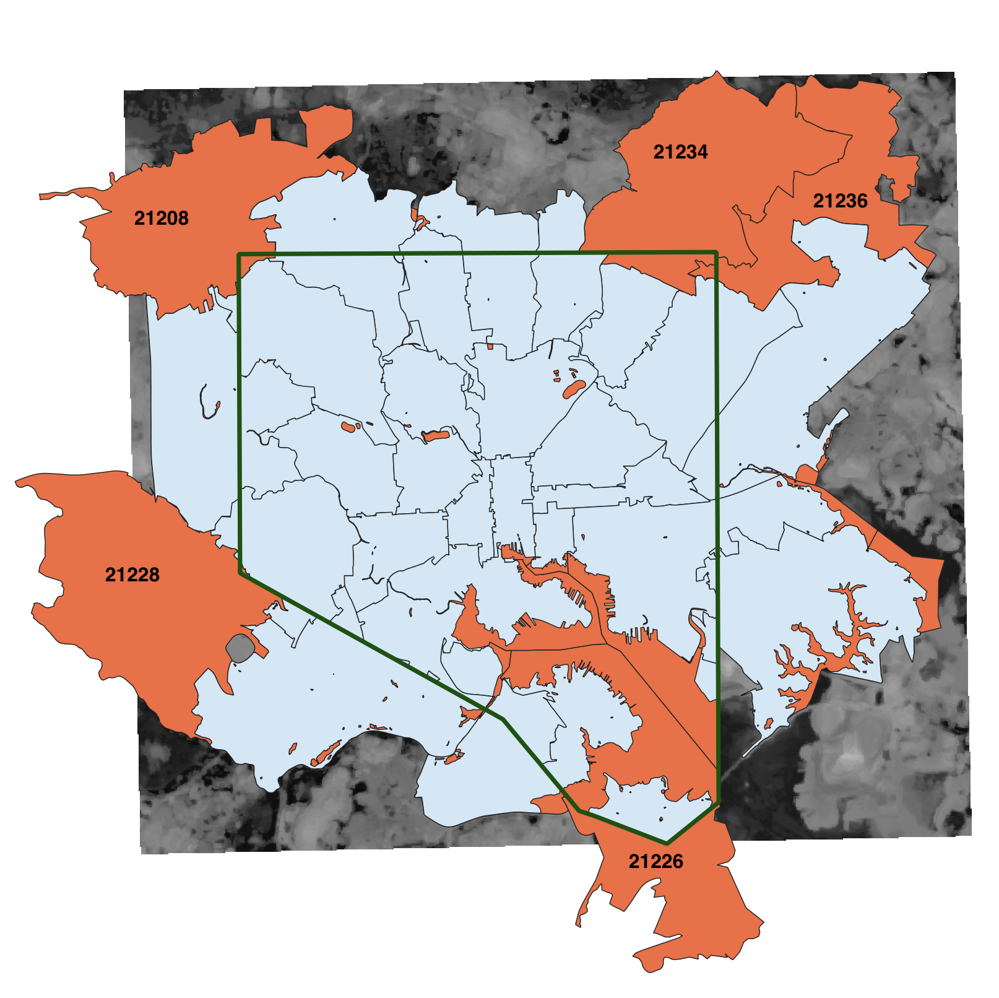

-   [Introduction](#introduction)
-   [Links to Data, Cleaning and Analysis Scripts, RMarkdown HTML Pages](#links-to-data-cleaning-and-analysis-scripts-rmarkdown-html-pages)
    -   [Definitions](#definitions)
-   [Setup](#setup)
-   [Load and clean urban heat island temperature data](#load-and-clean-urban-heat-island-temperature-data)
    -   [Define functions](#define-functions)
    -   [Execute load-in and cleaning](#execute-load-in-and-cleaning)
-   [Load and Clean Tree Canopy LIDAR Data](#load-and-clean-tree-canopy-lidar-data)
    -   [Execute load-in and cleaning](#execute-load-in-and-cleaning-1)
-   [Load and Clean Demographic Data](#load-and-clean-demographic-data)
    -   [Execute load-in and cleaning](#execute-load-in-and-cleaning-2)
-   [Combine Data for Each Geographic Area](#combine-data-for-each-geographic-area)
-   [Load and Clean Individual Tree Data](#load-and-clean-individual-tree-data)
    -   [Define functions and store universal variables](#define-functions-and-store-universal-variables)
    -   [Execute load-in and cleaning](#execute-load-in-and-cleaning-3)
    -   [Create building block tables](#create-building-block-tables)
    -   [Join all into master summary table](#join-all-into-master-summary-table)
-   [Load and Clean Redlining Data](#load-and-clean-redlining-data)
    -   [Execute load in and cleaning](#execute-load-in-and-cleaning-4)
-   [Load and Clean Hourly Temperature Data at BWI and Inner Harbor (DMH)](#load-and-clean-hourly-temperature-data-at-bwi-and-inner-harbor-dmh)
    -   [Execute load-in and cleaning](#execute-load-in-and-cleaning-5)
-   [Load and Clean EMS Data](#load-and-clean-ems-data)
    -   [Execute load-in and cleaning](#execute-load-in-and-cleaning-6)
-   [Load and Clean Hospital Admissions Data](#load-and-clean-hospital-admissions-data)
    -   [Define functions and store universal variables](#define-functions-and-store-universal-variables-1)
    -   [Execute Load in and Cleaning](#execute-load-in-and-cleaning-7)
-   [Load and clean sensor data](#load-and-clean-sensor-data)
    -   [Store universal variables](#store-universal-variables)
    -   [Execute load-in and cleaning](#execute-load-in-and-cleaning-8)
-   [Load and Clean Historical Baltimore and U.S. Weather Data](#load-and-clean-historical-baltimore-and-u.s.-weather-data)
    -   [Execute load-in and cleaning](#execute-load-in-and-cleaning-9)
-   [Increase in Hot Days Data](#increase-in-hot-days-data)
-   [Output All Cleaned Data to CSV Files](#output-all-cleaned-data-to-csv-files)

Introduction
------------

This R markdown document describes the methodology and results of the data cleaning portion of the data analysis conducted for a reporting project examining the effects of climate-change driven temperature increases on the health of people who live in cities. The project was done in partnership with the [University of Maryland Philip Merrill College of Journalism](https://merrill.umd.edu/), [Capital News Service](https://cnsmaryland.org/), [the Howard Center for Investigative Journalism](https://merrill.umd.edu/about-merrill/signature-programs/the-howard-center-for-investigative-journalism/), [NPR](https://www.npr.org/), [Wide Angle Youth Media](https://www.wideanglemedia.org/) and [WMAR](https://www.wmar2news.com/). It also moved on the Associated Press wire.

Here are links to stories in the series published by participating organizations:

**CNSMaryland**

-   [Code Red: Baltimore's Climate Divide](https://cnsmaryland.org/interactives/summer-2019/code-red/introduction.html)
-   [Heat & Inequality: In Baltimore, the burden of rising temperatures isn’t shared](https://cnsmaryland.org/interactives/summer-2019/code-red/neighborhood-heat-inequality.html)
-   [Heat & Health: For people with chronic health conditions, heat and humidity are more than a summer nuisance](https://cnsmaryland.org/interactives/summer-2019/code-red/heat-health.html)
-   [The Role of Trees: No trees, no shade, no relief as climate heats up](https://cnsmaryland.org/interactives/summer-2019/code-red/role-of-trees.html)
-   [Seeking Solutions: Are government leaders and residents ready to act?](https://cnsmaryland.org/interactives/summer-2019/code-red/city-climate-future.html)
-   [Behind The Scenes: A look at how and why we reported the series](https://cnsmaryland.org/interactives/summer-2019/code-red/behind-scenes.html)

**NPR**

-   [As Rising Heat Bakes U.S. Cities, The Poor Often Feel It Most](https://www.npr.org/2019/09/03/754044732/as-rising-heat-bakes-u-s-cities-the-poor-often-feel-it-most)
-   [Trees Are Key To Fighting Urban Heat — But Cities Keep Losing Them](https://www.npr.org/2019/09/04/755349748/trees-are-key-to-fighting-urban-heat-but-cities-keep-losing-them)
-   [How High Heat Can Impact Mental Health](https://www.npr.org/templates/story/story.php?storyId=757034136&live=1)

**WMAR**

-   [Baltimore neighborhood identified as 'ground zero' for local effects of climate crisis](https://www.wmar2news.com/news/region/baltimore-city/baltimore-neighborhood-identified-as-ground-zero-for-local-effects-of-climate-crisis)

**Associated Press**

-   [Investigation: Urban poor hit hardest as the planet heats up](https://www.apnews.com/52ffefa9ecf144d1b9aec367cc52ea74)
-   [As temperatures rise, overdoses and hospital visits increase](https://www.apnews.com/4d83616b5ecd46d5896d274a37b39de9)
-   [No trees, no shade, no relief in cities as climate heats up](https://www.apnews.com/bebe7895ce374f6f9070fe69ab557c4f)

Links to Data, Cleaning and Analysis Scripts, RMarkdown HTML Pages
------------------------------------------------------------------

-   The entire codebase for this analysis, including R markdown cleaning and analysis scripts -- and the raw and cleaned data needed to reproduce the cleaning and analysis, is available through the [Howard Center's GitHub](https://github.com/Howard-Center-Investigations/Code-Red-Baltimore-Climate-Divide).
-   [Repo Readme](https://github.com/Howard-Center-Investigations/Code-Red-Baltimore-Climate-Divide/README.md)
-   Data
    -   [Data cleaning script](https://github.com/Howard-Center-Investigations/Code-Red-Baltimore-Climate-Divide/documentation/Data-Cleaning/Data-Cleaning.Rmd)
    -   [Raw data folder](https://github.com/Howard-Center-Investigations/Code-Red-Baltimore-Climate-Divide/data/input-data)
    -   [Cleaned data folder](https://github.com/Howard-Center-Investigations/Code-Red-Baltimore-Climate-Divide/data/putput-data)
-   Analysis
    -   [Analysis for NPR](https://github.com/Howard-Center-Investigations/Code-Red-Baltimore-Climate-Divide/documentation/NPR/NPR-Analysis.Rmd)
    -   [Heat and inequality story analysis](https://github.com/Howard-Center-Investigations/Code-Red-Baltimore-Climate-Divide/documentation/Heat-Inequality/Heat-Inequality-Analysis.Rmd)
    -   [Heat and health story analysis](https://github.com/Howard-Center-Investigations/Code-Red-Baltimore-Climate-Divide/documentation/Heat-Health/Heat-Health-Analysis.Rmd)
    -   [Role of trees story analysis](https://github.com/Howard-Center-Investigations/Code-Red-Baltimore-Climate-Divide/documentation/Role-of-Trees/Role-of-Trees-Analysis.Rmd)
-   A site with HTML versions of the R markdown files, for fact-checking the completed the analysis.
-   [Landing page](https://howard-center-investigations.github.io/code-red-baltimore-climate-divide/index.html)
-   [Data cleaning script](https://howard-center-investigations.github.io/code-red-baltimore-climate-divide/Data-Cleaning.html)
-   [Analysis for NPR](https://howard-center-investigations.github.io/code-red-baltimore-climate-divide/NPR-Analysis.html)
-   [Heat and inequality story analysis](https://howard-center-investigations.github.io/code-red-baltimore-climate-divide/Heat-Inequality-Analysis.html)
-   [Heat and health story analysis](https://howard-center-investigations.github.io/code-red-baltimore-climate-divide/Heat-Health-Analysis.html)
-   [Role of trees story analysis](https://howard-center-investigations.github.io/code-red-baltimore-climate-divide/Role-of-Trees-Analysis.html)
-   NPR has made available a separate GitHub repo for nationwide analysis on urban heat islands available [here](https://github.com/nprapps/heat-income).

### Definitions

**Geographic Units**: Several geographic units are used throughout the analysis. The geographic units are:

-   **U.S. Census block**: The smallest geographic area tracked by the U.S. Census bureau. Shapefiles downloaded from [Census.gov](https://www2.census.gov/geo/tiger/TIGER2018/TABBLOCK/).
-   **ZCTAs - ZIP Code Tabulation Areas**: A U.S. Census proxy for postal ZIP Code units. Shapefiles downloaded from [Census.gov](https://www2.census.gov/geo/tiger/TIGER2018/ZCTA5/).
-   **NSAs - Neighborhood Statistical Areas**: Areas created by Baltimore City to represent Baltimore neighborhoods, comprised of custom groupings of U.S. Census blocks. This grouping is considered by Baltimore City and this analysis as the best representation of true Baltimore neighborhoods. Shapefiles provided by the [Baltimore City Department of Planning](https://planning.baltimorecity.gov/maps-data/GIS).
-   **CSAs - Community Statistical Areas**: Groupings of neighborhoods, created and used by the Baltimore Neighborhood Indicators Alliance (BNIA). In some cases, there is one neighborhood per CSA; in others, it's multiple. Recent demographic data is only available by CSA. Shapefiles downloaded from the [Baltimore Neighborhood Indicators Alliance Vital Signs project](https://data-bniajfi.opendata.arcgis.com/datasets/794586676bcc4f5fb629c08c51474cf6_0).
-   **Redlined geographic units**: Between 1935 and 1940, local real estate lenders, developers and real estate appraisers assigned grades to residential neighborhoods based on the perceived risk for banks to grant loans. This process was based in part on the race of residents and is known today as "redlining." The ["Mapping Inequality"](https://dsl.richmond.edu/panorama/redlining/#loc=5/39.1/-94.58&text=intro) project, conducted by [teams at four different universities](https://dsl.richmond.edu/panorama/redlining/#loc=12/39.293/-76.679&text=about), generated interactive maps of cities across the U.S., including Baltimore, and made their [shapefiles available by city](https://dsl.richmond.edu/panorama/redlining/#loc=11/39.3/-76.673&text=downloads).

**A Note About ZCTAs**:

-   There are some slight differences in the exact boundaries between ZCTA shapefiles pulled from Census.gov when pulled county-by-county and for MD as a whole. All ZCTA groups are from the state-level ZCTA files.
-   The Mid-Atlantic Terminal at Dundalk (sometimes included as part of the 21222 ZCTA) is not included.
-   All calculations for included ZCTAs are done over the entire ZCTA, even when the ZCTA expands past the city boundary, with one exception. 21226 is cut off at the city boundary due to limitations the in treecover and heat maps. In addition, a small peninsula in that same ZCTA was removed for ease in computing.
-   4 ZCTAs ('21208', '21228', '21234', '21236') encroach slightly into Baltimore City, but were not included due to limitations in treecover and heat maps.
-   3 included ZCTAs ('21227', '21222', '21237') only encroach slightly into Baltimore City but were included because the treecover and heat maps encompass them.
-   An insignificant portion of the north end of 21237 is not included on the treecover map and is therefore missing from calculations made for that ZCTA.
-   ZCTA lists for reference:
-   Complete list of Baltimore ZCTAs: '21201', '21202', '21205', '21206', '21207', '21208', '21209', '21210', '21211', '21212', '21213', '21214', '21215', '21216', '21217', '21218', '21222', '21223', '21224', '21225', '21226', '21227', '21228', '21229', '21230', '21231', '21234', '21236', '21237', '21239', '21251'
-   ZCTAs removed from list (for untrimmed): '21208', '21228', '21234', '21236'
-   Complete list of ZCTAs used (for untrimmed): '21201', '21202', '21205', '21206', '21207', '21209', '21210', '21211', '21212', '21213', '21214', '21215', '21216', '21217', '21218', '21222', '21223', '21224', '21225', '21226', '21227', '21229', '21230', '21231', '21237', '21239', '21251'



Setup
-----

``` r
#######################
#### Load Packages ####
#######################

#rm(list=ls())
library(lubridate) # For working with dates
library(tidyverse) # For data science goodness
library(janitor) # For cleaning names
library(weathermetrics) # For calculating heat index
library(readxl) # For reading in Excel files
library(corrr) # For correlations
library(spelling) # For spellchecking

# Turn off scientific notation in RStudio (prevents accidental coersion to character type)
options(scipen = 999)

# Define path to root of data input folder
path_to_data <- "../../data/input-data/"
```

Load and clean urban heat island temperature data
-------------------------------------------------

Researchers at Portland State University in Oregon and the Science Museum of Virginia provided temperature data from their Urban Heat Island Temperature study, which captured micro-level temperature variations for all of Baltimore City on August 29, 2018.

-   The data can be downloaded [here](https://osf.io/e63x9/).
-   Full methodology paper [here](https://osf.io/ur7my/).

Temperature data was compiled in three batches for morning, afternoon and evening, in a raster image with one temperature value (in degrees celsius) per pixel.

For each time period, reporters used the open-source mapping program [QGIS](https://qgis.org/en/site/) to calculate zonal statistics (mean, median, min and max) for the temperature in several geographic units.

After calculating the zonal statistics, reporters exported the files from QGIS as CSV files, loaded them into R and joined them into master tables for further processing and analysis.

### Define functions

``` r
# Convert celsius values to fahrenheit (could later replace with weathermetrics, which produces same values in multiple tests weathermetrics::celsius.to.fahrenheit())
c_to_f_convert <- function(x) (x * (9/5) + 32)
```

### Execute load-in and cleaning

``` r
#######################
###### Afternoon ######
#######################

# define specific folder in input data
folder <- "urban_heat_island_temperature/afternoon/"

# Afternoon temperatures by Block
temp_aft_block <- read_csv(paste0(path_to_data, folder, "temp-by-block_af.csv")) %>%
  filter(COUNTYFP10 == "510") %>%
  rename(temp_mean_aft = temp_mean,
         temp_median_aft = temp_median,
         temp_min_aft = temp_min,
         temp_max_aft = temp_max) %>%
  mutate_at(vars(contains("temp")), c_to_f_convert)

# Afternoon temperatures by ZCTA (ZIP Code Tabulation Area)
temp_aft_zcta <- read_csv(paste0(path_to_data, folder, "temp-by-zcta-not-clipped-to-balt-city-border_af.csv")) %>%
  rename(temp_mean_aft = t_af_mean,
         temp_median_aft = t_af_median,
         temp_min_aft = t_af_min,
         temp_max_aft = t_af_max) %>%
  mutate_at(vars(contains("temp")), c_to_f_convert)

# Afternoon temperatures by Neighborhood Statistical Area (best representation of true city neighborhoods)
temp_aft_nsa <- read_csv(paste0(path_to_data, folder, "temp-by-nsa_af.csv")) %>%
  rename(temp_mean_aft = temp_mean,
         temp_median_aft = temp_median,
         temp_min_aft = temp_min,
         temp_max_aft = temp_max) %>%
  mutate_at(vars(contains("temp")), c_to_f_convert)

# Afternoon temperatures by Community Statistical Area (small groups of city neighborhoods)
temp_aft_csa <- read_csv(paste0(path_to_data, folder, "temp-by-csa_af.csv")) %>%
  mutate(temp_median = temp_media) %>%
  select(OBJECTID, CSA2010, temp_mean, temp_median, temp_min, temp_max) %>%
  rename(temp_mean_aft = temp_mean,
         temp_median_aft = temp_median,
         temp_min_aft = temp_min,
         temp_max_aft = temp_max) %>%
  mutate_at(vars(contains("temp")), c_to_f_convert)

#######################
###### Morning ########
#######################

# define specific folder in input data
folder <- "urban_heat_island_temperature/morning/"

# Morning temperatures by Block
temp_am_block <- read_csv(paste0(path_to_data, folder, "temp-by-block_am.csv")) %>%
  filter(COUNTYFP10 == "510") %>%
  rename(temp_mean_am = temp_mea_3,
         temp_median_am = temp_med_1,
         temp_min_am = temp_min_1,
         temp_max_am = temp_max_1) %>%
  mutate_at(vars(contains("temp")), c_to_f_convert)

# Morning temperatures by ZCTA (ZIP Code Tabulation Area)
temp_am_zcta <- read_csv(paste0(path_to_data, folder, "temp-by-zcta-not-clipped-to-balt-city-border_am.csv")) %>%
  rename(temp_mean_am = t_am_mean,
         temp_median_am = t_am_median,
         temp_min_am = t_am_min,
         temp_max_am = t_am_max) %>%
  mutate_at(vars(contains("temp")), c_to_f_convert)

# Morning temperatures by Neighborhood Statistical Area (best representation of true city neighborhoods)
temp_am_nsa <- read_csv(paste0(path_to_data, folder, "temp-by-nsa_am.csv")) %>%
  rename(temp_mean_am = temp_mean,
         temp_median_am = temp_median,
         temp_min_am = temp_min,
         temp_max_am = temp_max) %>%
  mutate_at(vars(contains("temp")), c_to_f_convert)

# Morning temperatures by Community Statistical Area (small groups of city neighborhoods)
temp_am_csa <- read_csv(paste0(path_to_data, folder, "temp-by-csa_am.csv")) %>%
  mutate(temp_mean_am = temp_mea_2,
         temp_median_am = temp_med_2,
         temp_min_am = temp_min_2,
         temp_max_am = temp_max_2) %>%
  select(OBJECTID, CSA2010, temp_mean_am, temp_median_am, temp_min_am, temp_max_am) %>%
  mutate_at(vars(contains("temp")), c_to_f_convert)

#######################
###### Evening ########
#######################

# define specific folder in input data
folder <- "urban_heat_island_temperature/evening/"

# Evening temperatures by Block
temp_pm_block <- read_csv(paste0(path_to_data, folder, "temp-by-block_pm.csv")) %>%
  filter(COUNTYFP10 == "510") %>%
  rename(temp_mean_pm = temp_mea_4,
         temp_median_pm = temp_med_2,
         temp_min_pm = temp_min_2,
         temp_max_pm = temp_max_2) %>%
  mutate_at(vars(contains("temp")), c_to_f_convert)

# Evening temperatures by ZCTA (ZIP Code Tabulation Area)
temp_pm_zcta <- read_csv(paste0(path_to_data, folder, "temp-by-zcta-not-clipped-to-balt-city-border_pm.csv"))  %>%
  rename(temp_mean_pm = t_pm_mean,
         temp_median_pm = t_pm_median,
         temp_min_pm = t_pm_min,
         temp_max_pm = t_pm_max) %>%
  mutate_at(vars(contains("temp")), c_to_f_convert)

# Evening temperatures by Neighborhood Statistical Area (best representation of true city neighborhoods)
temp_pm_nsa <- read_csv(paste0(path_to_data, folder, "temp-by-nsa_pm.csv")) %>%
  rename(temp_mean_pm = temp_mean,
         temp_median_pm = temp_median,
         temp_min_pm = temp_min,
         temp_max_pm = temp_max) %>%
  mutate_at(vars(contains("temp")), c_to_f_convert)

# Evening temperatures by Community Statistical Area (small groups of city neighborhoods)
temp_pm_csa <- read_csv(paste0(path_to_data, folder, "temp-by-csa_pm.csv")) %>%
  mutate(temp_mean_pm = temp_mea_1,
         temp_median_pm = temp_med_1,
         temp_min_pm = temp_min_1,
         temp_max_pm = temp_max_1) %>%
  select(OBJECTID, CSA2010, temp_mean_pm, temp_median_pm, temp_min_pm, temp_max_pm) %>%
  mutate_at(vars(contains("temp")), c_to_f_convert)

######################################
###### JOIN AM, AFTERNOON, PM ########
######################################

all_temp_block <- temp_am_block %>%
  left_join(temp_aft_block) %>%
  left_join(temp_pm_block) %>%
  mutate_at(vars(matches("STATEFP10"), matches("GEOID10")), as.character) %>% # Recast non-calculable variables as characters
  rename_all(tolower) %>% # Standardize variable naming capitalization
  select(-statefp10, -countyfp10)

all_temp_csa <- temp_am_csa %>%
  left_join(temp_aft_csa) %>%
  left_join(temp_pm_csa) %>%
  mutate_at(vars(matches("OBJECTID")), as.character) %>% # Recast non-calculable variables as characters
  rename_all(tolower) # Standardize variable naming capitalization

all_temp_nsa <- temp_am_nsa %>%
  left_join(temp_aft_nsa) %>%
  left_join(temp_pm_nsa) %>%
  rename_all(tolower) # Standardize variable naming capitalization

all_temp_zcta <- temp_am_zcta %>%
  left_join(temp_aft_zcta) %>%
  left_join(temp_pm_zcta) %>%
  mutate_at(vars(matches("ZCTA5CE10"), matches("GEOID10")), as.character) %>% # Recast non-calculable variables as characters
  rename_all(tolower) # Standardize variable naming capitalization

#### Remove unneeded files ####
rm(list=setdiff(ls(), c("all_temp_block", "all_temp_zcta", "all_temp_nsa", "all_temp_csa", "path_to_data")))
```

Load and Clean Tree Canopy LIDAR Data
-------------------------------------

The U.S. Forest Service and the University of Vermont Spatial Analysis Lab Spatial Analysis Lab created detailed maps of Baltimore's tree canopy in 2007 and 2015 using LIDAR and aerial imagery data (Citation: O'Neil-Dunne J. 2017. GIS Shapefile, Tree Canopy Change 2007 - 2015 - Baltimore City. Environmental Data Initiative. <https://doi.org/10.6073/pasta/79c1d2079271546e61823a98df2d2039>).

The original shapefile data was presented in terms of "no change," "gain," and "loss" categories. To perform the following analysis, we restructured the data within QGIS to represent 2007 and 2015 canopy coverage and calculated zonal statistics (mean and median) at each year. They then exported the data from QGIS into CSVs, loaded them into R and joined them into master tables for further processing and analysis.

### Execute load-in and cleaning

``` r
# Define specific folder in input data
folder <- "tree-canopy/"

#######################
###### Blocks #########
#######################

# 2007
tree_block_lidar_2007 <- read_csv(paste0(path_to_data, folder, "by_block/btree_statistics_by_block_2007_lidar.csv")) %>%
  rename_all(tolower)

# 2015
tree_block_lidar_2015 <- read_csv(paste0(path_to_data, folder, "by_block/btree_statistics_by_block_2015_lidar.csv")) %>%
  rename_all(tolower)

# Join 2007 to 2015
tree_block_lidar_2007_2015 <- tree_block_lidar_2007 %>%
  left_join(tree_block_lidar_2015) %>%
  mutate(
    lid_change_percent = (`15_mean`-`07_mean`)/`07_mean`,
    lid_change_percent_point = (`15_mean`-`07_mean`)
  ) %>%
  rename("07_lid_mean" = "07_mean",
         "15_lid_mean" = "15_mean") %>%
  # Recast non-calculable variables as characters
  mutate_at(vars(matches("geoid10"), matches("statefp10"), 
                 matches("countyfp10"), matches("blockce10")
  ),
  as.character)

#######################
###### CSAs ###########
#######################

# 2007
tree_csa_lidar_2007 <- read_csv(paste0(path_to_data, folder, "by_community_statistical_area/btree_statistics_by_csa_2007_lidar.csv"))

# 2015
tree_csa_lidar_2015 <- read_csv(paste0(path_to_data, folder, "by_community_statistical_area/btree_statistics_by_csa_2015_lidar.csv"))

# Join 2007 to 2015
tree_csa_lidar_2007_2015 <- tree_csa_lidar_2007 %>%
  left_join(tree_csa_lidar_2015) %>%
  mutate(
    lid_change_percent = (`15_mean`-`07_mean`)/`07_mean`,
    lid_change_percent_point = (`15_mean`-`07_mean`)
  ) %>%
  rename_all(tolower) %>%
  select(-matches("17\\-*")) %>%
  rename("07_lid_mean" = "07_mean",
         "15_lid_mean" = "15_mean") %>%
  # Recast non-calculable variables as characters
  mutate("objectid" = as.character(objectid)) 

#######################
###### NSAs  ##########
#######################

# 2007
tree_nsa_lidar_2007 <- read_csv(paste0(path_to_data, folder, "by_neighborhood_statistical_area/btree_statistics_by_nsa_2007_lidar.csv"))

# 2015
tree_nsa_lidar_2015 <- read_csv(paste0(path_to_data, folder, "by_neighborhood_statistical_area/btree_statistics_by_nsa_2015_lidar.csv"))

# Join 2007 to 2015
tree_nsa_lidar_2007_2015 <- tree_nsa_lidar_2007 %>%
  left_join(tree_nsa_lidar_2015) %>%
  mutate(
    lid_change_percent = (`15_mean`-`07_mean`)/`07_mean`,
    lid_change_percent_point = (`15_mean`-`07_mean`)
  ) %>%
  rename_all(tolower) %>%
  rename("07_lid_mean" = "07_mean",
         "15_lid_mean" = "15_mean") %>%
  select(-matches("nbrdesc"), -matches("color_2")) %>%
  # Recast non-calculable variables as characters
  mutate("objectid" = as.character(objectid)) 
```

``` r
# Remove unneeded files
rm(list=setdiff(ls(), c(
  "tree_block_lidar_2007_2015", "tree_nsa_lidar_2007_2015", "tree_csa_lidar_2007_2015", 
  "all_temp_block", "all_temp_zcta", "all_temp_nsa", "all_temp_csa", "path_to_data")))
```

Load and Clean Demographic Data
-------------------------------

The only recent demographic data available for neighborhood proxy areas is from the [Baltimore Neighborhood Indicators Alliance](https://bniajfi.org/vital_signs/data_downloads/), a **CSA-level** analysis from 2017. The U.S. federal government has not collected demographic information at many micro-geographic levels with reasonable margins of error since the 2010 Census, which this analysis determined is generally too old to be useful. The exception to this is the annual [American Community Survey](https://www.census.gov/acs/www/data/data-tables-and-tools/data-profiles/2017/), which we used at a **ZCTA-level** geographic grouping. Additionally, this analysis used the 2010 population numbers at the **block** level to filter out low-population blocks. This portion of the analysis did not use demographic information at the **NSA** level, because the data did not exist in a readily available format with reasonable error margins.

### Execute load-in and cleaning

``` r
# Common file path to raw demographics data
folder <- "demographics/"

#### Blocks #### 
# Read in 2010 population data, SF1 U.S. Census data by block. Used only to filter out no population blocks before doing analysis. Otherwise, 2010 data is too old to use.
demographics_block <- read_csv(paste0(path_to_data, folder, "by_block/2010_SF1_Baltimore_City_Population_by_Block.csv")) %>%
  rename_all(tolower) %>%
  mutate("geoid10" = as.character(geoid10))

#### CSA #### 
# Data from BNIA, reading in 2017 values. https://bniajfi.org/vital_signs/data_downloads/.  
# Clean column names and remove citywide values for Baltimore City so it joins correctly. 
demographics_csa <- read_csv(paste0(path_to_data, folder, "by_community_statistical_area/VS_Indicators_2017_Only_BNIA.csv")) %>%
  clean_names() %>%
  rename_all(tolower) %>%
  filter(csa2010 != "Baltimore City")

#### NSA #### 
# No available demographic data, because these are shapefiles constructed by the city from census blocks, not an actual U.S. Census product.  Block groups and tracts stretch across the boundaries. Therefore, the only available valid data is from the 2010 Census.

#### ZCTA #### 
# From American Community Survey, 5 year averages 2017.
demographics_zcta <- read_csv(paste0(path_to_data, folder, "by_zcta/acs_2017_baltimore_zctas.csv")) %>%
  rename_all(tolower) %>%
  filter(zcta != "CITYWIDE")
```

Combine Data for Each Geographic Area
-------------------------------------

Once the individual component data frames have been created and cleaned, they can be merged and saved for use in the analysis.

``` r
#### Blocks #### 
# Demographics at this level only used for removing low population blocks
blocks_tree_temp_population <- all_temp_block %>%
  rename_all(tolower) %>% 
  left_join(tree_block_lidar_2007_2015) %>%
  left_join(demographics_block) %>%
  rename_all(tolower) %>%
  select(-"countyfp10", -"statefp10", -"tractce10", -"blockce10", -"name10", -"mtfcc10", -"uace10", -"uatype", -"funcstat10", -"name", -"ur10") %>%
  mutate(lid_change_percent = ifelse(is.infinite(lid_change_percent) | is.nan(lid_change_percent), NA, lid_change_percent)) %>%
  select("geoid10", "population_2010", everything())
# Merge check:  All three files have 13598 records, as does the merged file

#### CSA ####
csa_tree_temp_demographics <- all_temp_csa %>%
  left_join(tree_csa_lidar_2007_2015) %>%
  left_join(demographics_csa) %>%
  rename_all(tolower) %>%
  select(-"id") %>%
  mutate_at(vars(csa2010), tolower)
# Merge check: All three files have 55 records, as does joined file

#### NSA ####
# Note: no demographics for this
nsa_tree_temp <- all_temp_nsa %>%
  left_join(tree_nsa_lidar_2007_2015, by=c('nsa_name' = 'label')) %>%
  rename_all(tolower) %>%
  filter(nsa_name != "Unnamed") %>%
  select(-matches("color_2")) %>%
  select("objectid", everything()) %>%
  mutate(lid_change_percent = ifelse(is.infinite(lid_change_percent) | is.nan(lid_change_percent), NA, lid_change_percent)) %>%
  mutate_at(vars(nsa_name), tolower)
# Merge check: the difference in the number of records between the temperature data frame (279) and the tree data frame (278) is because temp has an extra record for Unnamed areas, because of slight differences between the extent of the temperature raster and the NSA shapefile. Here, we drop the unnamed column on join.

#### ZCTA ####
zcta_temp_demographics <- all_temp_zcta %>%
  right_join(demographics_zcta, by=c('zcta5ce10' = 'zcta')) %>%
  rename_all(tolower) %>%
  rename(zcta = 'zcta5ce10') %>%
  select(-"geoid10", -"classfp10", -"mtfcc10", -"funcstat10")
# Merge check: All tables have 55 records

#### Remove unneeded files ####
rm(list=setdiff(ls(), c("blocks_tree_temp_population", "zcta_temp_demographics", "nsa_tree_temp", "csa_tree_temp_demographics", "path_to_data")))
```

Load and Clean Individual Tree Data
-----------------------------------

Baltimore's urban forestry division tracks each tree and potential tree site across the city and provided this analysis with a database of those records and [accompanying documentation](street-tree-inventory-spec-sheet.pdf).

The raw data arrived as a .shp file, which reporters joined together with the various core geographies and exported as a CSV for processing in R. The analysis focused on NSA-level geographies.

### Define functions and store universal variables

``` r
# List of NSAs of interest for our analysis
target_nsas <- c("Berea", "Broadway East", "Oliver", "Middle East", "Biddle Street","Milton-Montford", "Madison-Eastend", "CARE", "McElderry Park", "Ellwood Park/Monument", "Patterson Place", "Patterson Park Neighborhood", "Baltimore Highlands", "Highlandtown", "Upper Fells Point") %>%
  lapply(tolower)

# List of nearby NSAs of interest for our analysis
counterpoint_nsas <- c("Butcher's Hill", "Canton", "Washington Hill") %>%
  lapply(tolower)

# Common file path to raw demographics data
folder <- "street-trees/csv/"
```

### Execute load-in and cleaning

``` r
##########################
#### Load in the data ####
##########################

street_trees <- read_csv(paste0(path_to_data, folder, "by_nsa/street_trees_nsa_join_table.csv")) %>%
  select(-COLOR_2, -LABEL) %>%
  rename_all(tolower) %>%
  mutate_all(tolower) %>%
  # Eliminate the "stump w" (typo), group "sprout" with "stump"
  mutate(condition = ifelse((condition == "stump w")|(condition == "sprouts"), "stump", condition)) %>%
  mutate(condition = ifelse(condition == "n/a", "unknown", condition)) %>%
  # Make "condition" a factor so it can be ordered
  mutate_at(vars(matches("condition")), 
            as.factor) %>%
  mutate(condition = fct_relevel(condition, 
                                 c("absent",
                                   "stump",
                                   "dead",
                                   "poor",
                                   "fair",
                                   "good",
                                   "unknown")
  )) %>%
  mutate_at(vars(matches("tree_ht"), matches("dbh")), as.numeric)

#############################################
### Add categories of planting difficulty ###
#############################################

###############################################
#### Levels of difficulty to plant ############
###############################################
# Live tree exists = NA = live tree           #
# Absent and not potential = 1 = easy         #
# Stump or dead = 2 = moderate                #
# Absent and potential = 3 = hard             #
# Absent and "not suitable" = 4 = unsuitable  #
# All others = 0 = unknown                    #
###############################################

# Note on trees marked as "Not suitable" in 'spp' or 'common' colunms: 
# "A space exists to plant but it may be too small or near a hazard or obstruction," 
# per Nathan Randolph, GIS Analyst at Department of Recreation and Parks.

### Add categories
street_trees_categorized <- street_trees %>%
  # Add col for top-level category
  mutate(has_live_tree = ifelse(
    (condition == "poor")|
      (condition == "fair")|
      (condition == "good"), 
    T, F)) %>%
  # Add col for second-level category as a number
  mutate(difficulty_level_num = case_when(
    # Difficulty of planting NA if tree already there.
    has_live_tree == T ~ NA_integer_,
    # Difficulty level 1 if...
    condition == "absent" & # No tree,
      !str_detect(space_type, "potential") & # Not marked "potential" aka doesn't require breaking concrete,
      (!str_detect(spp, "not suit") | !str_detect(common, "not suit") # Not marked unsuitable.
      ) ~ 1L,
    # Difficulty level 2 if removal of dead tree required.
    condition == "stump" | condition == "dead" ~ 2L,
    # Difficulty level 3 if... 
    condition == "absent" & # Marked absent (AND by elimination also marked potential),
      (!str_detect(spp, "not suit") | !str_detect(common, "not suit") # Not marked unsuitable.
      ) ~ 3L, 
    # Difficulty level 4 if marked unsuitable
    str_detect(spp, "not suit") ~ 4L,
    # Catches all others at difficulty level 0 (9 erratta: "unknown")
    TRUE ~ 0L
  ) ) %>%
  # Add col for second-level category as plain language
  mutate(difficulty_level = case_when(
    is.na(difficulty_level_num) ~ "has live tree",
    difficulty_level_num == 1L ~ "easy",
    difficulty_level_num == 2L ~ "moderate",
    difficulty_level_num == 3L ~ "hard",
    difficulty_level_num == 4L ~ "unsuitable",
    TRUE ~ NA_character_
  ) ) %>%
  # Add col to denote target NSAs
  mutate(is_target_nsa = case_when(
    nbrdesc %in% target_nsas ~ T,
    TRUE ~ F 
  )) %>%
  # Add col to denote counterpoint NSAs
  mutate(is_counterpoint_nsa = case_when(
    nbrdesc %in% counterpoint_nsas ~ T,
    TRUE ~ F 
  )) %>%
  # Lightly clean the genus field
  mutate(genus_clean = if_else(is.na(genus) | str_detect(genus, pattern = "\\.|,"), word(spp,1), genus)) %>%
  mutate(genus_clean = case_when(
    genus_clean == "horsechestnut" ~ "aesculus",
    genus_clean == "goldenraintree" ~ "koelreuteria",
    genus_clean == "honeylocust" ~ "gleditsia",
    genus_clean == "japanese pagodatree" ~ "styphnolobium",
    genus_clean == "mimosa" ~ "albizia",
    genus_clean == "royal paulownia" ~ "paulownia tomentosa",
    genus_clean == "tuliptree" ~ "liriodendron",
    genus_clean == "tree of heaven" ~ "ailanthus",
    genus_clean == "yellowwood" ~ "cladrastis",
    genus_clean == "blackgum" ~ "nyssa",
    genus_clean == "boxelder" ~ "acer",
    genus_clean == "douglas-fir" ~ "pseudotsuga",
    genus_clean == "katsuratree" ~ "cercidiphyllum",
    genus_clean == "kentucky coffeetree" ~ "gymnocladus",
    genus_clean == "persian parrotia" ~ "parrotia",
    TRUE ~ genus_clean
  ))
```

### Create building block tables

``` r
######################################################
### Basic count tables, required for later queries ###
######################################################

# Count total spaces that are tracked, both with and without trees
spaces_count_by_nsa <- street_trees_categorized %>%
  group_by(nbrdesc) %>%
  dplyr::summarize(all_tracked_spaces = n()) %>%
  # Add ranking so we can say NSA is #x citywide
  arrange(nbrdesc, all_tracked_spaces) %>%
  mutate(rank_all_tracked_spaces = rank(desc(all_tracked_spaces), na.last = "keep", ties.method = "first"))

# Count total spaces with live trees (later we want to know the percent *of existing trees* at each condition)
live_count_by_nsa <- street_trees_categorized %>% 
  filter(has_live_tree == T) %>%
  group_by(nbrdesc) %>%
  dplyr::summarize(spaces_with_live_trees = n()) %>%
  # Add ranking so we can say NSA is #x citywide
  arrange(nbrdesc, spaces_with_live_trees) %>%
  mutate(rank_spaces_with_live_trees = rank(desc(spaces_with_live_trees), na.last = "keep", ties.method = "first"))

# Count total spaces without live trees (includes dead trees and stumps)
empty_spaces_count_by_nsa <- street_trees_categorized %>% 
  # Only spaces without a live tree
  filter(has_live_tree == F) %>%
  # Use difficulty level to categorize by suitable/unsuitable
  mutate(is_suitable = case_when(
    difficulty_level_num == 4 ~ F,
    TRUE ~ T
  )) %>%
  group_by(nbrdesc, is_suitable) %>%
  dplyr::summarize(count_spaces = n()) %>%
  tidyr::spread(is_suitable, count_spaces) %>%
  dplyr::rename(
    suitable_without_tree = "TRUE",
    unsuitable_without_tree = "FALSE"
  ) %>%
  # Include the total (KI: Should just be a rowsum but can't get that to work.)
  left_join(street_trees_categorized %>% 
              filter(has_live_tree == F) %>%
              group_by(nbrdesc) %>%
              dplyr::summarize(spaces_without_live_trees = n())) %>%
  # Add ranking for each category so can say NSA is #x in terms of each category citywide
  dplyr::arrange(nbrdesc, unsuitable_without_tree) %>%
  mutate(rank_unsuitable_without_tree = rank(desc(unsuitable_without_tree), na.last = "keep", ties.method = "first")) %>%
  dplyr::arrange(nbrdesc, suitable_without_tree) %>%
  mutate(rank_suitable_without_tree = rank(desc(suitable_without_tree), na.last = "keep", ties.method = "first")) %>%
  dplyr::arrange(nbrdesc, spaces_without_live_trees) %>%
  mutate(rank_spaces_without_live_trees = rank(desc(spaces_without_live_trees), na.last = "keep", ties.method = "first"))

# Combine all counts into single table of COUNT of LIVE/EMPTY/(SUITABLE/UNSUITABLE)/ALL
spaces_count_by_nsa_all <- spaces_count_by_nsa %>%
  left_join(live_count_by_nsa) %>%
  left_join(empty_spaces_count_by_nsa)

# Find PERCENTs of trees/spaces/suitable/nonsuitable:
tree_as_percent_of_spaces_by_nsa <- spaces_count_by_nsa_all %>%
  # 1. percent of trees compared to total spaces
  mutate(perc_spaces_treed = round(100*(spaces_with_live_trees / all_tracked_spaces), 2)) %>%
  # 2. percent of non-tree'ed spaces compared to total spaces
  mutate(perc_spaces_nontreed = round(100*(spaces_without_live_trees / all_tracked_spaces), 2)) %>%
  # 3. percent of non-tree'ed spaces are suitable non-tree'ed spaces
  mutate(perc_of_nontreed_are_suitable = round(100*(suitable_without_tree / spaces_without_live_trees), 2)) %>%
  # Add ranking for each category so can say NSA is #x in terms of each category citywide
  dplyr::arrange(nbrdesc, perc_spaces_treed) %>%
  mutate(rank_perc_spaces_treed = rank(desc(perc_spaces_treed), na.last = "keep", ties.method = "first")) %>%
  dplyr::arrange(nbrdesc, perc_spaces_nontreed) %>%
  mutate(rank_perc_spaces_nontreed = rank(desc(perc_spaces_nontreed), na.last = "keep", ties.method = "first")) %>%
  dplyr::arrange(nbrdesc, perc_of_nontreed_are_suitable) %>%
  mutate(rank_perc_of_nontreed_are_suitable = rank(desc(perc_of_nontreed_are_suitable), na.last = "keep", ties.method = "first"))
```

``` r
###################################
### Difficulty of planting ########
###################################

# COUNT spaces AT EACH DIFFICULTY in each nsa
empty_spaces_by_diff_by_nsa_count <- street_trees_categorized %>% 
  group_by(nbrdesc, difficulty_level_num) %>%
  dplyr::summarize(num = n()) %>%
  tidyr::spread(difficulty_level_num, num) %>%
  dplyr::rename(
    num_unknown = "0",
    num_easy = "1",
    num_moderate = "2",
    num_hard = "3",
    num_not_suitable = "4",
    num_spaces_with_live_trees = "<NA>"
  ) %>%
  select(-num_unknown)

# PERCENT of total empty spots AT EACH DIFFICULTY in each nsa
empty_spaces_by_diff_by_nsa_perc <- street_trees_categorized %>% 
  group_by(nbrdesc, difficulty_level_num) %>%
  dplyr::summarize(num = n()) %>%
  # Join totals for perc calc
  left_join(tree_as_percent_of_spaces_by_nsa %>% select(nbrdesc , spaces_without_live_trees)) %>%
  mutate(perc_difflvl_to_empty_spaces = round(100*(num/spaces_without_live_trees), 2)) %>%
  select(-num) %>%
  tidyr::spread(difficulty_level_num, perc_difflvl_to_empty_spaces) %>%
  select(-"<NA>") %>%
  dplyr::rename(
    perc_of_nontreed_unknown = "0",
    perc_of_nontreed_easy = "1",
    perc_of_nontreed_moderate = "2",
    perc_of_nontreed_hard = "3",
    perc_of_nontreed_unsuitable = "4",
    num_spaces_without_live_trees = "spaces_without_live_trees"
  ) %>%
  select(-perc_of_nontreed_unknown)

# Join into master DIFFICULTY table
empty_spaces_by_diff_by_nsa <- empty_spaces_by_diff_by_nsa_count %>%
  left_join(empty_spaces_by_diff_by_nsa_perc) %>%
  # Rearange for readability
  select(1, 6:7, 2:5, 8:11)
```

``` r
######################################
### Tree condition by nsa ############
######################################

# Tree condition by neighborhood starting table
tree_condition_by_nsa_long <- street_trees_categorized %>% 
  # Filter for tree-able spaces with live trees, because we want to know the percent *of existing trees* at each condition
  filter(has_live_tree == T) %>%
  group_by(nbrdesc, condition) %>%
  dplyr::summarize(num_trees = n()) %>%
  # Find percent of live trees are in each condition?
  # Join table to get total number of live trees
  left_join(tree_as_percent_of_spaces_by_nsa) %>%
  mutate(perc_condition_to_live_trees = round(100*(num_trees/spaces_with_live_trees), 2))

# Tree condition percent by nsa
tree_condition_perc_by_nsa_wide <- tree_condition_by_nsa_long %>%
  # Select cols to spread
  select(nbrdesc, condition, perc_condition_to_live_trees) %>%
  tidyr::spread(condition, perc_condition_to_live_trees) %>%
  dplyr::rename(
    poor_perc_of_live = poor,
    fair_perc_of_live = fair,
    good_perc_of_live = good
  ) 

# Tree condition count by nsa
tree_condition_count_by_nsa_wide <- tree_condition_by_nsa_long %>%
  # Select cols to spread
  select(nbrdesc, condition, num_trees) %>%
  tidyr::spread(condition, num_trees) %>%
  dplyr::rename(
    poor_count = poor,
    fair_count = fair,
    good_count = good
  )

# Join condition info tables into final
tree_condition_by_nsa <- tree_condition_perc_by_nsa_wide %>%
  left_join(tree_condition_count_by_nsa_wide) %>%
  left_join(tree_as_percent_of_spaces_by_nsa %>% select(nbrdesc, spaces_with_live_trees)) %>%
  # Rearange for readability
  select(
    1, 8, 5:7, 2:4
  )

############################################
### Tree height/diameter by neighborhood ###
############################################

# Tree height/diameter
tree_height_diam_by_nsa <- street_trees_categorized %>%
  filter(has_live_tree == T) %>%
  group_by(nbrdesc) %>%
  dplyr::summarize(combined_ht = sum(tree_ht),
                   avg_ht = round(mean(tree_ht), 2),
                   combined_diam = sum(dbh),
                   avg_diam = round(mean(dbh), 2)
  )

# Add to tree_condition_by_nsa
tree_condition_by_nsa <- tree_condition_by_nsa %>%
  left_join(tree_height_diam_by_nsa) %>%
  # Drop combined totals cols
  select(-contains("combined")) %>%
  # If fewer than 50 trees, make a new cols for height and diameter, replace number with NA
  mutate(avg_ht_controled = ifelse(
    spaces_with_live_trees < 50, NA_real_, avg_ht),
    avg_diam_controled = ifelse(
      spaces_with_live_trees < 50, NA_real_, avg_diam)
  ) %>%
  # Add ranking for each category so can say NSA is #x in terms of each category citywide
  dplyr::arrange(nbrdesc, avg_ht_controled) %>%
  mutate(rank_avg_ht = rank(desc(avg_ht_controled), na.last = "keep", ties.method = "first")) %>%
  dplyr::arrange(nbrdesc, avg_diam_controled) %>%
  mutate(rank_avg_diam = rank(desc(avg_diam_controled), na.last = "keep", ties.method = "first"))
```

### Join all into master summary table

``` r
master_street_trees_by_nsa <- tree_as_percent_of_spaces_by_nsa %>%
  left_join(empty_spaces_by_diff_by_nsa) %>%
  left_join(tree_condition_by_nsa) %>%
  # Add ranking for perc good
  arrange(nbrdesc, good_perc_of_live) %>%
  mutate(rank_good_perc_of_live = rank(desc(good_perc_of_live), na.last = "keep", ties.method = "first")) %>%
  # Add ranking for perc poor
  arrange(nbrdesc, poor_perc_of_live) %>%
  mutate(rank_poor_perc_of_live = rank(desc(poor_perc_of_live), na.last = "keep", ties.method = "first")) %>%
  # Add col for is/isn't NSA of interest
  mutate(is_target_nsa = case_when(
    nbrdesc %in% target_nsas ~ T,
    TRUE ~ F 
  ))

#### Remove unneeded files ####
rm(list=setdiff(ls(), c("blocks_tree_temp_population", "zcta_temp_demographics", "nsa_tree_temp", "csa_tree_temp_demographics", "street_trees_categorized", "redlining_tree", "master_street_trees_by_nsa", "path_to_data")))
```

Load and Clean Redlining Data
-----------------------------

This analysis used QGIS to compute tree canopy for geographies based on redlining shapefiles downloaded from the [Mapping Inequality project](https://dsl.richmond.edu/panorama/redlining/#loc=11/39.3/-76.673&text=downloads).

### Execute load in and cleaning

``` r
# Common file path to raw redlining data
folder <- "redlining-data/"

# Load data
redlining_tree <- read_csv(paste0(path_to_data, folder, "HOLC_Redlining_2015_tree_canopy.csv")) %>%
  select(-matches("name"), -matches("area_descr")) %>%
  mutate(grade_descr = case_when(
    holc_grade == "A" ~ "best",
    holc_grade == "B" ~ "still desirable",
    holc_grade == "C" ~ "definitely declining",
    holc_grade == "D" ~ "hazardous",
    T ~ NA_character_
  )) %>%
  select(holc_id, holc_grade, grade_descr, 
         count_all_pix_15 = `15_count`, 
         sum_canopy_pix_15 = `15_sum`, 
         mean_pix_15 = `15_mean`)
```

Load and Clean Hourly Temperature Data at BWI and Inner Harbor (DMH)
--------------------------------------------------------------------

We acquired historical temperature data for National Weather Service monitoring stations at both BWI airport (BWI) and the Inner Harbor monitoring station (DMH) and used it in various parts of our analysis. We got this data from the [Iowa State University Iowa Environmental Mesonet](https://mesonet.agron.iastate.edu/), which contains information for [global ASOS monitoring stations](https://mesonet.agron.iastate.edu/request/download.phtml). We captured temperature, humidity and dew point data, which we used to calculate heat index.

### Execute load-in and cleaning

``` r
# Store folder path

folder <- "baltimore-weather-stations/"

# Load BWI and DMH data 
bwi <- read_csv(paste0(path_to_data, folder, "BWI-1-1-45-current.txt"))
dmh <- read_csv(paste0(path_to_data, folder, "DMH-5-1-98-9-2-2019.txt"))

# Clean BWI data 
bwi <- bwi  %>%
  select(-relh) %>%
  filter(tmpf != 'M', dwpf != 'M') %>%
  mutate(tmpf = as.numeric(tmpf),
         dwpf = as.numeric(dwpf)) %>%
  mutate(date = as.Date(valid, format="%Y-%m-%d")) %>%
  mutate(year=year(valid)) %>%
  mutate(month=month(valid)) %>%
  mutate(day=day(valid)) %>%
  mutate(hour=hour(valid)) %>%
  distinct(valid, .keep_all = TRUE) %>%
  mutate(heat_index = heat.index(t=tmpf, dp=dwpf, temperature.metric = "fahrenheit", round=0)) %>%
  mutate(relative_humidity = dewpoint.to.humidity(dp = dwpf, t = tmpf, temperature.metric = "fahrenheit")) %>%
  select(date, year, month, day, hour, tmpf, dwpf, relative_humidity, heat_index) %>%
  group_by(date, year, month, day, hour) %>%
  summarise(avg_hourly_temperature_bwi = mean(tmpf),
            avg_hourly_dewpoint_bwi = mean(dwpf),
            avg_hourly_relative_humidity_bwi = mean(relative_humidity),
            avg_hourly_heat_index_bwi = mean(heat_index)
  ) %>%
  distinct()

# Clean DMH data 
dmh <- dmh  %>%
  select(-relh) %>%
  filter(tmpf != 'M', dwpf != 'M') %>%
  mutate(tmpf = as.numeric(tmpf),
         dwpf = as.numeric(dwpf)) %>%
  mutate(date = as.Date(valid, format="%Y-%m-%d")) %>%
  mutate(year=year(valid)) %>%
  mutate(month=month(valid)) %>%
  mutate(day=day(valid)) %>%
  mutate(hour=hour(valid)) %>%
  distinct(valid, .keep_all = TRUE) %>%
  mutate(heat_index = heat.index(t=tmpf, dp=dwpf, temperature.metric = "fahrenheit", round=0)) %>%
  mutate(relative_humidity = dewpoint.to.humidity(dp = dwpf, t = tmpf, temperature.metric = "fahrenheit")) %>%
  select(date, year, month, day, hour, tmpf, dwpf, relative_humidity, heat_index) %>%
  group_by(date, year, month, day, hour) %>%
  summarise(avg_hourly_temperature_dmh = mean(tmpf),
            avg_hourly_dewpoint_dmh = mean(dwpf),
            avg_hourly_relative_humidity_dmh = mean(relative_humidity),
            avg_hourly_heat_index_dmh = mean(heat_index)
  ) %>%
  distinct()


# We have 75 years of dew point and temperature data for BWI, which allows us to calculate heat index
# We have 20 years of dew point and temperature data for DMH (Inner Harbor), which allows us to calculate heat index. 
# Dan Li, a climate researcher at Boston University who has studied variation in urban heat island temperatures between suburbs in different seasons and different hours of the day, said a pretty good way to calculate the difference in urban v suburban heat island, and create a longer estimated historical record of temperatures at DMH would be:

# Join the 20 years of DMH data to the 20 years of BWI data.  Join on date and hour, so we end up with a data frame of values for both DMH and BWI for each date and hour in our data set.  Do an inner join, so that if for some reason DMH is missing an hour from its data set (or vice versa), it doesn't mess up our averages. Calculate new columns with difference in temperature, dew point, relative humidity and heat index between BWI and DMH.  Since in almost all cases BWI will be colder than DMH, make it so the difference is positive if DMH is greater than BWI.

dmh_bwi <- bwi %>%
  inner_join(dmh, by = c("date", "hour")) %>%
  rename(year = year.x, month = month.x, day = day.x) %>%
  select(-year.y, -month.y, -day.y) %>%
  mutate(temperature_difference = avg_hourly_temperature_dmh - avg_hourly_temperature_bwi,
         dew_point_difference = avg_hourly_dewpoint_dmh - avg_hourly_dewpoint_bwi,
         relative_humidity_difference = avg_hourly_relative_humidity_dmh - avg_hourly_relative_humidity_bwi,
         heat_index_difference = avg_hourly_heat_index_dmh - avg_hourly_heat_index_bwi) 

# Group by month and hour and calculate the AVERAGE difference in temperature, dew point, relative humidity and heat index. 
dmh_bwi_monthly_by_hour <- dmh_bwi %>%
  group_by(month, hour) %>%
  summarize(avg_temperature_difference = mean(temperature_difference),
         avg_dew_point_difference = mean(dew_point_difference),
         avg_relative_humidity_difference = mean(relative_humidity_difference),
         avg_heat_index_difference = mean(heat_index_difference))
  
# Go back to the original 75 years of BWI data (after it's been cleaned, not on raw import).  Write case when function adjusting the temperature and dew point values based on table created in step 4. Create two new columns to recalculate heat index and relative humidity (see cleaning function above, weathermetrics package has a nice way of doing this). Call them adjusted_heat_index, adjusted_relative_humidity 

estimated_historical_dmh <- bwi %>%
  inner_join(dmh_bwi_monthly_by_hour, by = c("month", "hour")) %>%
  mutate(projected_temperature_dmh = avg_hourly_temperature_bwi + avg_temperature_difference,
         projected_dew_point_dmh = avg_hourly_dewpoint_bwi +  avg_dew_point_difference,
         projected_heat_index_dmh = heat.index(t=projected_temperature_dmh, dp=projected_dew_point_dmh, temperature.metric = "fahrenheit", round=0),
         projected_relative_humidity_dmh = dewpoint.to.humidity(dp = projected_dew_point_dmh, t = projected_temperature_dmh, temperature.metric = "fahrenheit")) %>%
         select(-matches("bwi"), -matches("avg"))
```

Load and Clean EMS Data
-----------------------

We obtained from Baltimore City EMS calls between 2014 and 2018. Each call included information about conditions and ZIP code of each call.

### Execute load-in and cleaning

``` r
# Folder path
folder <- "baltimore-ems/"

# Load in five CSVs, one for each year
EMS_2014 <- read.csv(paste0(path_to_data, folder, "2014.csv"))
EMS_2015 <- read.csv(paste0(path_to_data, folder, "2015.csv"))
EMS_2016 <- read.csv(paste0(path_to_data, folder, "2016.csv"))
EMS_2017 <- read.csv(paste0(path_to_data, folder, "2017.csv"))
EMS_2018_partial <- read.csv(paste0(path_to_data, folder, "2018-1.1-11.30.csv"))

# Bind together into one dataframe

EMS_all <- bind_rows(EMS_2014, EMS_2015, EMS_2016, EMS_2017, EMS_2018_partial)

# Remove all dataframes from our environment but EMS_all

# rm(list=setdiff(ls(), "EMS_all"))

#################################
#### Clean EMS Data #############
#################################

# Rename columns to get rid of funky codes

EMS_all <- EMS_all %>%
  rename(incident_date = Incident.Date,
         incident_number = Incident.Number,
         primary_impression =  Primary.Impression,
         arrived_on_scene_time = Times...Arrived.on.Scene.Time,
         zipcode = Incident.Postal.Code..E8.15.,
         destination_patient_disposition = Destination.Patient.Disposition..E20.10.,
         destination_code = Destination.Code..E20.2.
  )

# Filter EMS_all to remove the dispositions we don't want.

EMS_all <- EMS_all %>%
  filter(destination_patient_disposition != "" &
           destination_patient_disposition != "No Patient Found" &
           destination_patient_disposition != "Cancelled en Route/On Arrival" &
           destination_patient_disposition != "Cancelled Prior to Response" &
           destination_patient_disposition != "Provided ALS personnel to scene, no transport" &
           destination_patient_disposition != "Standby Only - No Patient Contacts" &
           destination_patient_disposition != "Cancelled On Arrival" &
           destination_patient_disposition != "Operational Support Provided Only")

# Remove N/A and blank values
EMS_all <- EMS_all[-which(EMS_all$arrived_on_scene_time=="" | is.na( EMS_all$incident_date) | EMS_all$incident_number=="" | EMS_all$primary_impression=="" | EMS_all$zipcode=="" | EMS_all$destination_patient_disposition==""), ]

# remove all characters from ZIP code field
v1 <- c("1", "2", "3", "4", "5", "6", "7", "8", "9", "0")
EMS_all$zipcode <- gsub(paste0("[^", paste(v1, collapse=""), "]+"), "", EMS_all$zipcode)

# Create an array of Baltimore ZIP codes used in our analysis
balt_zips <- c("21201","21202","21205","21206","21207","21208","21209","21210","21211","21212","21213","21214", "21215","21216","21217","21218","21222","21223","21224","21225","21226","21227","21228","21229", "21230","21231","21234","21236","21237","21239","21251")

# Filter out handful of unneeded ZIPs
EMS_all <- subset(EMS_all, zipcode %in% balt_zips )

# Create full datetime object of arrival time
EMS_all <- EMS_all %>%
  mutate(arrive_time = as.POSIXct(paste(incident_date, arrived_on_scene_time), format="%m/%d/%y %H:%M:%S")) %>%
  # mutate(date = as.Date(arrive_time, format="%y-%m-%d" tz="")) %>%
  mutate(year=year(arrive_time)) %>%
  mutate(month=month(arrive_time)) %>%
  mutate(day=day(arrive_time)) %>%
  mutate(hour=hour(arrive_time)) %>%
  mutate(date = make_date(year = year, month = month, day= day)) %>%
  select(date, year, month, day, hour, arrived_on_scene_time, zipcode, primary_impression)

# Working from the original primary impression field, crated a new field called primary impression group that keeps the names of things we care to examine, and lump everything else into "other" category.  Also create a higher level primary impression category that groups like conditions together.
EMS_all <- EMS_all %>%
  mutate(primary_impression_group = if_else(primary_impression %in% c("Pain", "Other", "Abdominal Pain/Problems", "Weakness", "Other Illness/Injury", "Nausea/Vomiting (Unknown Etiology)", "General Malaise/Sick", "Back Pain (Non-Traumatic)", "Headache", "OB/Gyn - Vaginal Hemorrhage", "Fever", "Unknown Problem", "Poisoning", "Drowning/Near Drowning", "Electrocution", "Inhalation Injury (Toxic Gas)", "Lightening Strike", "Depressurization/Scuba", "SIDS (Sudden Infant Death Syndrome)", "Traumatic Injury", "OB/Gyn - Other", "OB/Gyn - OB/Delivery", "Sepsis",  "Other CNS Problem", "Migraine", "Allergic Reaction", "Abuse / Neglect", "Stings/Venomous Bites", "Airway Obstruction", "Anaphylaxis", "Hypovolemia/Shock", "Overpressurization", "Hazmat Exposure - Chem, Bio, Rad", "Inhalation - Smoke", "Sexual Assault/Rape", "Other Endocrine/Metabolic Problem", "Bowel Obstruction", "Apparent Life-Threatening Event", "Diarrhea", "Burn", "Pregnancy/OB Delivery", "G.I. Bleed", "Other GU Problems", "Patient Assist Only", "Not Applicable", "Other Abdominal/GI Problem", "No Apparent Illness/Injury"), "Other", primary_impression),
         primary_impression_category = case_when(
           primary_impression_group %in% c("ETOH Abuse", "Withdrawal/Overdose ETOH", "Withdrawal/Overdose Drugs", "Altered Level of Consciousness", "Substance/Drug Abuse") ~ "Substance abuse",
           primary_impression_group %in% c("Cardiac Arrest", "Cardiac Rhythm Disturbance", "Hypotension", "Hypertension", "CHF (Congestive Heart Failure)", "Chest Pain/Discomfort", "Chest Pain - STEMI", "Other Cardiovascular Problem", "Abdominal Aortic Aneurysm" ) ~ "Heart/circulatory",
           primary_impression_group %in% c("Heat Exhaustion/Heat Stroke", "Hyperthermia" ) ~ "Acute heat conditions",
           primary_impression_group %in% c("Diabetic Hypoglycemia", "Diabetic Hyperglycemia") ~ "Diabetes complication",
           primary_impression_group %in% c("COPD (Emphysema/Chronic Bronchitis)", "Asthma", "Respiratory Distress", "Respiratory Arrest", "Croup") ~ "Respiratory",
           primary_impression_group %in% c("Stroke/CVA", "TIA (Transient Ischemic Attack)") ~ "Stroke",
           TRUE ~ primary_impression_group
         ))

# Join to temperature data

EMS_all <- inner_join(EMS_all, dmh, by=c("date","hour"))

## Adjust for Urban Heat Island and Calculate Adjusted Heat Index
# For each call, we now have the temperature and heat index value as recorded at the Inner Harbor station at the date and time of the call.  But we have not yet accounted for the fact that, in Baltimore City, temperatures can vary greatly between the Inner Harbor and other parts of the city.  We obtained urban heat island raster images, showing block-by-block temperature variations in Baltimore calculated using mobile temperature sensors and satellite data on August 29, 2018. (Citation: Shandas, V.; Voelkel, J.; Williams, J.; Hoffman, J. Integrating Satellite and Ground Measurements for Predicting Locations of Extreme Urban Heat. Climate 2019, 7, 5.  https://osf.io/e63x9/) and processed them in QGIS to obtain median afternoon temperatures for each ZIP code in our analysis.  We then adjusted each call's Inner Harbor temperature to account for the delta between the Inner Harbor monitoring station's ZIP code (21230) temperature in the urban heat island study and each call's ZIP code temperature in the urban heat island study.  Using the adjusted temperature, we recalculated the heat index using the dew point reading captured at the Inner Harbor.   

##########################################################
# Adjust for Urban Heat Island and Calculate Heat Index ##
##########################################################

# Load urban heat island data with morning, aft and night median temperature.

all_temp_zcta_ems <- zcta_temp_demographics %>%
  select(zcta, temp_median_am, temp_median_aft, temp_median_pm) %>%
  mutate(zipcode = zcta)

# Calculate difference between Inner Harbor (KDMH) station temperature. A positive value in difference columns means warmer than inner harbor KDMH weather station at Science Center. A negative value means cooler.
all_temp_zcta_ems <- all_temp_zcta_ems %>%
  mutate(temp_median_am_kdmh_zip = 79.6,
         temp_median_aft_kdmh_zip = 95.3,
         temp_median_pm_kdmh_zip = 89.8,
         am_difference = temp_median_am - temp_median_am_kdmh_zip,
         aft_difference = temp_median_aft - temp_median_aft_kdmh_zip,
         pm_difference = temp_median_pm - temp_median_pm_kdmh_zip,
         zipcode = as.character(zipcode)
         ) %>%
  select(zipcode, matches("difference"))

# Join urban_heat_zcta to EMS_all
EMS_all <- EMS_all %>%
  inner_join(all_temp_zcta_ems, by=c("zipcode"))

# Create columns with adjusted temperature
EMS_all <- EMS_all %>%
  mutate(adjusted_temperature =
           case_when(hour >= 20 ~ as.character(avg_hourly_temperature_dmh + pm_difference),
                     hour >= 12 ~ as.character(avg_hourly_temperature_dmh + aft_difference),
                     hour >= 4 ~ as.character(avg_hourly_temperature_dmh + am_difference),
                     hour >= 0 ~ as.character(avg_hourly_temperature_dmh + pm_difference)
                     ),
         adjusted_temperature = round(as.numeric(adjusted_temperature), 0)
      )

# Now that we've adjusted temperature, calculate the adjusted heat index
EMS_all <- EMS_all %>%
  mutate(adjusted_heat_index = heat.index(t=adjusted_temperature, dp=avg_hourly_dewpoint_dmh, temperature.metric = "fahrenheit", output.metric = "fahrenheit"))

## Create Heat Index Buckets

#In order to examine the impact of extreme temperatures on EMS calls, we need to assign each call's adjusted heat index value to one of four temperature buckets we've created to align with the National Weather Service's heat index safety threshold table. https://www.weather.gov/safety/heat-index. 

#The NWS heat index formula assumes conditions of light wind and shade, noting that exposure to full sun can increase heat index values by up to 15 degrees. We didn't feel comfortable adjusting heat index values to account for this, so this is where we are.  We were also unable to obtain the necessary data to calculate "wet bulb globe temperature", which the NWS says can be a better measure of heat stress in full sunlight. 

#The NWS heat index buckets are:
#* < 80 = not unsafe temperatures for heat
#* 80-89 = caution
#* 90-102 = extreme caution
#* 103-124 = danger
#* Approximately 125+ = extreme danger 

# Create a NWS temperature bucket in our joined calls-temp data set with a five-part NWS temperature danger scale.
EMS_all <- EMS_all %>%
  mutate(adjusted_heat_index_nws_five_scale_bucket = case_when(
    adjusted_heat_index <= 79 ~ "not_unsafe_under_80",
    adjusted_heat_index >= 80 & adjusted_heat_index <= 89 ~ "caution_80_89",
    adjusted_heat_index >= 90 & adjusted_heat_index <= 102 ~ "extreme_caution_90_102",
    adjusted_heat_index >= 103 & adjusted_heat_index <= 124 ~ "danger_103_124",
    adjusted_heat_index >= 125 ~ "extreme_danger_125_plus"
  )
  )

# For later calculations, we're also going to have to create these NWS temperature buckets in our temperature data set.  

dmh_ems <- dmh %>%
  mutate(heat_index_nws_five_scale_bucket = case_when(
    avg_hourly_heat_index_dmh <= 79 ~ "not_unsafe_under_80",
    avg_hourly_heat_index_dmh >= 80 & avg_hourly_heat_index_dmh <= 89 ~ "caution_80_89",
    avg_hourly_heat_index_dmh >= 90 & avg_hourly_heat_index_dmh <= 102 ~ "extreme_caution_90_102",
    avg_hourly_heat_index_dmh >= 103 & avg_hourly_heat_index_dmh <= 124 ~ "danger_103_124",
    avg_hourly_heat_index_dmh >= 125 ~ "extreme_danger_125_plus"
  ))
  

## Filter Data Only for Summer Dates
# We only want to examine last summer in Baltimore (2018), so we need to filter our full_data and temp_data sets. 

EMS_all <- EMS_all %>%
filter(`date` >= date("2018-06-21") & `date` <= ("2018-09-21"))

dmh_ems <- dmh_ems %>%
filter(`date` >= date("2018-06-21") & `date` <= ("2018-09-21"))
```

Load and Clean Hospital Admissions Data
---------------------------------------

From the [Health Services Cost Review Commission in Maryland](https://hscrc.state.md.us/pages/default.aspx), we obtained detailed records of inpatient and outpatient hospital visits, with one record per visit, between 2013 and 2018. The code for processing the data is included here, but we cannot store the original files that are processed by that code, per our memorandum of understanding with the HSCRC.

### Define functions and store universal variables

``` r
# Common file path to raw EMS data
folder <- "hscrc-hospital-data/"

# Function to make correlation matrix
make_correlation_matrix <- function(dataframe) {
  # Read in hospital data and join it to demographics by zipcode
  temp <- left_join(dataframe, zcta_temp_demographics, by=c("ZIPCODE" = "zcta"))
  # Filter data for needed columns and remove unneeded zipcodes
  temp <- temp %>%
    select(matches('ZIPCODE'), 
           matches('kidney_disease'),             
           matches('copd'),                     
           matches('asthma'),                    
           matches('heart_attack'),             
           matches('congestive_artery_disease'),
           matches('angina_pectoris'),           
           matches('heart_disease'),            
           matches('diabetes'),
           matches('temp_median_aft'),
           matches('median_household_income_d'),
           matches('poverty_%')
    ) %>%
    na.omit(temp_median_aft)
  
  # Add merged temperature + condition dataframe to environment
  table_name <- paste0(deparse(substitute(dataframe)), "_disease_heat")
  assign(table_name, temp, envir = parent.frame())
  
  # Build correlation matrix
  correlation_matrix <- temp %>%
    select(-ZIPCODE) %>%
    as.matrix %>%
    correlate() %>%
    focus(-matches("_prev")) %>%
    select(matches("rowname|_%$|_f$|_d$|_a$|^temp_|_mean$")) %>%
    filter(complete.cases(.))
    
  # Add merged temperature + condition dataframe to environment
  table_name <- paste0(deparse(substitute(dataframe)), "_correlation_matrix")
  assign(table_name, correlation_matrix, envir = parent.frame())

}
```

### Execute Load in and Cleaning

``` r
# Load inpatient hospital admissions percentage by zipcode 
ip_full_zip <- read_csv(paste0(path_to_data, folder, "ip/ip_full_zip.csv"))
ip_full_zip <- ip_full_zip %>%
  filter(ZIPCODE != "CITYWIDE", ZIPCODE != "21251") %>%
  select(ZIPCODE, matches("asthma"), matches("kidney"), matches("diabetes"), matches("copd"), matches("heart"), matches("angina"), matches("artery"), -matches("count"), -matches("percap"), -matches("population") )

# Load inpatient hospital admissions percentage by zipcode, broken down by medicaid status
ip_full_zip_medicaid <- read_csv(paste0(path_to_data, folder, "ip/ip_full_medicaid.csv"))
ip_full_zip_medicaid <- ip_full_zip_medicaid %>%
  filter(ZIPCODE != "CITYWIDE", ZIPCODE != "21251") %>%
  select(ZIPCODE, matches("asthma"), matches("kidney"), matches("diabetes"), matches("copd"), matches("heart"), matches("angina"), matches("artery"), -matches("count"), -matches("percap"), -matches("population"), -matches("not"), -matches("commercial")) %>%
  select(ZIPCODE, matches("medicaid"))

# Load ER hospital admissions percentage by zipcode 
op_er_full_zip <- read_csv(paste0(path_to_data, folder, "op_er/op_er_full_zip.csv"))
op_er_full_zip <- op_er_full_zip %>%
  filter(ZIPCODE != "CITYWIDE", ZIPCODE != "21251") %>%
  select(ZIPCODE, matches("asthma"), matches("kidney"), matches("diabetes"), matches("copd"), matches("heart"), matches("angina"), matches("artery"), -matches("count"), -matches("percap"), -matches("population") )

# Load ER hospital admissions percentage by zipcode, broken down by medicaid status
op_er_full_zip_medicaid <- read_csv(paste0(path_to_data, folder, "op_er/op_er_full_medicaid.csv"))
op_er_full_zip_medicaid <- op_er_full_zip_medicaid %>%
  filter(ZIPCODE != "CITYWIDE", ZIPCODE != "21251") %>%
  select(ZIPCODE, matches("asthma"), matches("kidney"), matches("diabetes"), matches("copd"), matches("heart"), matches("angina"), matches("artery"), -matches("count"), -matches("percap"), -matches("population"), -matches("not"), -matches("commercial")) %>%
  select(ZIPCODE, matches("medicaid"))

# Execute function to create correlation matrixes and data frame for each function. 
make_correlation_matrix(ip_full_zip)
make_correlation_matrix(ip_full_zip_medicaid)
make_correlation_matrix(op_er_full_zip)
make_correlation_matrix(op_er_full_zip_medicaid)
```

Load and clean sensor data
--------------------------

We built temperature and humidity sensors, using this ["Harlem Heat" project guide](https://github.com/datanews/harlem-heat) created by WNYC public radio for their [Harlem Heat Project](https://www.wnyc.org/series/harlem-heat-project). We placed them in several homes in Baltimore in summer 2019 and joined them with outdoor temperature to examine how heat index varied indoors and out.

### Store universal variables

``` r
# Common file path to raw EMS data
folder <- "temperature-sensors/"

### Define column headers for sensor readings data ###
sensor_col_names <- c("sensor_id", "unix_time", "datetime", "temperature", "relative_humidity", "battery_life")

#######################################
##### Sensor Processing Function ######
#######################################

process_sensor_data <- function(person_location) {
  # parse date objects and remove unneeded columns
  temp <- person_location %>%  
    mutate(date = date(datetime)) %>%
    mutate(year = year(datetime)) %>%
    mutate(month = month(datetime)) %>%
    mutate(day = day(datetime)) %>%
    mutate(hour = hour(datetime)) %>%
    mutate(minute = minute(datetime)) %>%
    select(datetime, date, year, month, day, hour, minute, temperature, relative_humidity) %>%
    mutate(heat_index = heat.index(t=temperature, rh=relative_humidity, temperature.metric = "fahrenheit")) %>%
    left_join(dmh, by = c("year", "month", "day", "hour")) %>%
    select(-contains(".y"), -contains("dew")) %>%
    rename(date = `date.x`) %>%
    mutate(indoor_temperature_difference = temperature - avg_hourly_temperature_dmh,
           indoor_heat_index_difference = heat_index - avg_hourly_heat_index_dmh)
  # calculate average temperature by day for the sensor, and store it as temporary object 
  temp_humidity_heat_index_day <- temp %>%
    group_by(date) %>%
    summarise(mean_indoor_temperature = round(mean(temperature),1),
              mean_indoor_heat_index = round(mean(heat_index),1),
              mean_indoor_relative_humidity = round(mean(relative_humidity),1),
              mean_outdoor_temperature = round(mean(avg_hourly_temperature_dmh),1),
              mean_outdoor_heat_index = round(mean(avg_hourly_heat_index_dmh),1),
              indoor_temperature_difference = mean_indoor_temperature - mean_outdoor_temperature,
              indoor_heat_index_difference = mean_indoor_heat_index - mean_outdoor_heat_index)
    table_name <- paste0(deparse(substitute(person_location)), "_day_averages")
    assign(table_name, temp_humidity_heat_index_day, envir = parent.frame())
    # calculate average temperature by day and hour for the sensor, and store it as temporary object 
    temp_humidity_heat_index_day_hour <- temp %>%
      mutate(date_hour = make_datetime(year = year, month = month, day = day, hour = hour)) %>%
      group_by(date_hour) %>%
      summarise(mean_indoor_temperature = round(mean(temperature),1),
                mean_indoor_heat_index = round(mean(heat_index),1),
                mean_indoor_relative_humidity = round(mean(relative_humidity),1),
                mean_outdoor_temperature = round(mean(avg_hourly_temperature_dmh),1),
                mean_outdoor_heat_index = round(mean(avg_hourly_heat_index_dmh),1),
                indoor_temperature_difference = mean_indoor_temperature - mean_outdoor_temperature,
                indoor_heat_index_difference = mean_indoor_heat_index - mean_outdoor_heat_index)
      table_name <- paste0(deparse(substitute(person_location)), "_day_hourly_averages")
      assign(table_name, temp_humidity_heat_index_day_hour, envir = parent.frame())
    # calculate average temperature by minute for the sensor, and store it as temporary object
    # Note: because temperature collection is done at intervals that are sometimes greater than a minute, won't have exactly one value per minute.
    temp_humidity_heat_index_day_minute <- temp %>%
    mutate(date_hour_minute = make_datetime(year = year, month = month, day = day, hour = hour, min = minute)) %>%
    group_by(date_hour_minute) %>%
    summarise(mean_indoor_temperature = round(mean(temperature),1),
                mean_indoor_heat_index = round(mean(heat_index),1),
                mean_indoor_relative_humidity = round(mean(relative_humidity),1),
                mean_outdoor_temperature = round(mean(avg_hourly_temperature_dmh),1),
                mean_outdoor_heat_index = round(mean(avg_hourly_heat_index_dmh),1),
                indoor_temperature_difference = mean_indoor_temperature - mean_outdoor_temperature,
                indoor_heat_index_difference = mean_indoor_heat_index - mean_outdoor_heat_index)
      table_name <- paste0(deparse(substitute(person_location)), "_day_minute_averages")
      assign(table_name, temp_humidity_heat_index_day_minute, envir = parent.frame())
}  
```

### Execute load-in and cleaning

``` r
#### Read in Data ####
# Stephanie Pingley bedroom
stephanie <- read_csv(paste0(path_to_data, folder, "stephanie/stephanie.TXT"), col_names = sensor_col_names)
# Michael and Alberta 
michael <- read_csv(paste0(path_to_data, folder, "michael/michael.TXT"), col_names = sensor_col_names)
# Tammy first floor
tammy <- read_csv(paste0(path_to_data, folder, "tammy/tammy-first-floor.TXT"), col_names = sensor_col_names)
# Audrey unknown location
audrey <- read_csv(paste0(path_to_data, folder, "audrey/audrey.TXT"), col_names = sensor_col_names)

process_sensor_data(stephanie)
process_sensor_data(michael)
process_sensor_data(tammy)
process_sensor_data(audrey)
```

Load and Clean Historical Baltimore and U.S. Weather Data
---------------------------------------------------------

To calculate how average annual temperatures in Baltimore changed compared to the U.S. over the last century, we pulled data from NOAA's National Climatic [Data Center](https://www.ncdc.noaa.gov/data-access) on [average annual temperatures](https://www.ncdc.noaa.gov/cag/county/time-series) for both geographies.

### Execute load-in and cleaning

``` r
# Common file path to raw temperature data
folder <- "1895-2019-average-temp/"

# Read in temperature data files for US
us_change_temp <- read_csv(paste0(path_to_data, folder, "us-change-temp.csv"))

# Read in temperature data files for Baltimore
baltimore_change_temp <- read_csv(paste0(path_to_data, folder, "baltimore-change-temp.csv")) 

# Clean date and select only needed columns for Baltimore
baltimore_change_temp <- baltimore_change_temp %>%
  mutate(Date = (Date - 12)/100) %>%
  clean_names()

# Clean date and select only needed columns for Baltimore
us_change_temp <- us_change_temp %>%
  mutate(Date = (Date - 12)/100) %>%
  clean_names()
```

Increase in Hot Days Data
-------------------------

To examine how climate change will drive up the number of extreme heat index days in the future, we used data from researchers at the Union of Concerned Scientists and the University of Idaho, described in the research paper: ["Increased frequency of and population exposure to extreme heat index days in the United States during the 21st century"](https://www.ucsusa.org/sites/default/files/attach/2019/07/killer-heat-environmental-research-communications-article.pdf). [The data we used is available here](https://www.ucsusa.org/global-warming/global-warming-impacts/killer-heat-in-united-states).

``` r
# Common file path to raw temperature data
folder <- "heat-index-projections/"

# Read in data
heat_index_projections <- read_xlsx(paste0(path_to_data,folder, "killer-heat-data-by-city.xlsx"), sheet="cleaned_all_cities")
```

Output All Cleaned Data to CSV Files
------------------------------------

The following generated files are necessary for future portions of this analysis.

``` r
### Define root save path

save_path <- "../../data/output-data/"

### Write to CSV 

## Tree Canopy, Heat Island Temperature, Demographics
# Define folder
folder <- "tree_temp_demographics/"
# Write out csvs
write_csv(blocks_tree_temp_population, paste0(save_path, folder, "blocks_tree_temp_demographics.csv"))
write_csv(csa_tree_temp_demographics, paste0(save_path, folder, "csa_tree_temp_demographics.csv"))
write_csv(nsa_tree_temp, paste0(save_path, folder, "nsa_tree_temp.csv"))
write_csv(zcta_temp_demographics, paste0(save_path, folder, "zcta_temp_demographics.csv"))

## Street Trees
# Define folder
folder <-  "street_trees/"
# Write out csvs
write_csv(street_trees_categorized, paste0(save_path, folder, "street_trees_nsa_categorized.csv"))
write_csv(master_street_trees_by_nsa,  paste0(save_path, folder, "street_trees_nsa_summarized.csv"))

## Redlining 
# Define folder
folder <-  "redlining_trees/"
# Write out csv
write_csv(redlining_tree, paste0(save_path, folder, "redlining_tree.csv"))

## EMS 
# Define folder
folder <-  "ems/"
# Write out csvs
write_csv(EMS_all, paste0(save_path, folder, "EMS_all.csv"))
write_csv(dmh_ems, paste0(save_path, folder, "dmh_ems.csv"))

## Weather stations
# Define folder
folder <-  "baltimore_weather_stations/"
# Write out csvs
write_csv(estimated_historical_dmh, paste0(save_path, folder, "estimated_historical_dmh.csv"))
write_csv(dmh, paste0(save_path, folder, "dmh.csv"))
write_csv(bwi, paste0(save_path, folder, "bwi.csv"))

## Sensor Data
# Define folder
folder <-  "temperature_sensors/stephanie/"
# Write out csvs
write_csv(stephanie_day_averages, paste0(save_path, folder, "stephanie_day_averages.csv"))
write_csv(stephanie_day_hourly_averages, paste0(save_path, folder, "stephanie_day_hourly_averages.csv"))
write_csv(stephanie_day_minute_averages, paste0(save_path, folder, "stephanie_day_minute_averages.csv"))
# Define folder
folder <-  "temperature_sensors/tammy/"
# Write out csvs
write_csv(tammy_day_averages, paste0(save_path, folder, "tammy_day_averages.csv"))
write_csv(tammy_day_hourly_averages, paste0(save_path, folder, "tammy_day_hourly_averages.csv"))
write_csv(tammy_day_minute_averages, paste0(save_path, folder, "tammy_day_minute_averages.csv"))
# Define folder
folder <-  "temperature_sensors/michael/"
# Write out csvs
write_csv(michael_day_averages, paste0(save_path, folder, "michael_day_averages.csv"))
write_csv(michael_day_hourly_averages, paste0(save_path, folder, "michael_day_hourly_averages.csv"))
write_csv(michael_day_minute_averages, paste0(save_path, folder, "michael_day_minute_averages.csv"))
# Define folder
folder <-  "temperature_sensors/audrey/"
# Write out csvs
write_csv(audrey_day_averages, paste0(save_path, folder, "audrey_day_averages.csv"))
write_csv(audrey_day_hourly_averages, paste0(save_path, folder, "audrey_day_hourly_averages.csv"))
write_csv(audrey_day_minute_averages, paste0(save_path, folder, "audrey_day_minute_averages.csv"))

## Hospital Data 
## Inpatient by Zip Code
# Define folder
folder <-  "hospital_data/ip/"
# Write out csv
write_csv(ip_full_zip_correlation_matrix, paste0(save_path, folder, "ip_full_zip_correlation_matrix.csv"))
write_csv(ip_full_zip_disease_heat, paste0(save_path, folder, "ip_full_zip_disease_heat.csv"))
# Medicaid Inpatient by Zip Code
# Write out csv
write_csv(ip_full_zip_medicaid_correlation_matrix, paste0(save_path, folder, "ip_full_zip_medicaid_correlation_matrix.csv"))
write_csv(ip_full_zip_medicaid_disease_heat, paste0(save_path, folder, "ip_full_zip_medicaid_disease_heat.csv"))

## Emergency Room by Zip Code
# Define folder
folder <-  "hospital_data/op_er/"
# Write csv
write_csv(op_er_full_zip_correlation_matrix, paste0(save_path, folder, "op_er_full_zip_correlation_matrix.csv"))
write_csv(op_er_full_zip_disease_heat, paste0(save_path, folder, "op_er_full_zip_disease_heat.csv"))
# Medicaid Emergency Room by ZipCode
# Write csv
write_csv(op_er_full_zip_medicaid_correlation_matrix, paste0(save_path, folder, "op_er_full_zip_medicaid_correlation_matrix.csv"))
write_csv(op_er_full_zip_medicaid_disease_heat, paste0(save_path, folder, "op_er_full_zip_medicaid_disease_heat.csv"))

### Clean up the workspace 
rm(list=ls())
```
