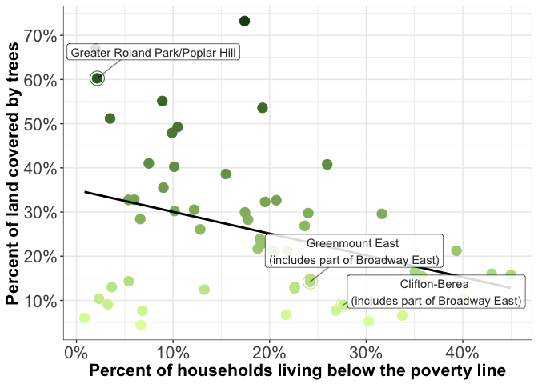

-   [Introduction](#introduction)
-   [Links to Data, Cleaning and Analysis Scripts, RMarkdown HTML Pages](#links-to-data-cleaning-and-analysis-scripts-rmarkdown-html-pages)
    -   [Load packages](#load-packages)
    -   [Load data](#load-data)
-   [Line-by-Line Fact Check \[Role of Trees\]](#line-by-line-fact-check-role-of-trees)
    -   [Fact: A certain block in Broadway East is one of the city's hottest \[cq\]](#fact-a-certain-block-in-broadway-east-is-one-of-the-citys-hottest-cq)
    -   [Fact: Poorest areas have less tree canopy \[cq\]](#fact-poorest-areas-have-less-tree-canopy-cq)
    -   [Fact: Poverty to canopy graphic \[cq\]](#fact-poverty-to-canopy-graphic-cq)
    -   [Fact: Heat and tree canopy relationship \[cq\]](#fact-heat-and-tree-canopy-relationship-cq)
    -   [Fact: Heat index at 1 p.m. July 10 \[cq\]](#fact-heat-index-at-1-p.m.-july-10-cq)
    -   [Fact: Street trees & plots on North Milton Ave. \[cq\]](#fact-street-trees-plots-on-north-milton-ave.-cq)
    -   [Fact: Northern CSAs are both wealthier and cooler \[cq\]](#fact-northern-csas-are-both-wealthier-and-cooler-cq)
    -   [Fact: Broadway East is a low-income neighborhood \[cq\]](#fact-broadway-east-is-a-low-income-neighborhood-cq)
    -   [Fact: McElderry Park temperature, wealth and canopy \[cq\]](#fact-mcelderry-park-temperature-wealth-and-canopy-cq)
    -   [Fact: Roland Park canopy \[cq\]](#fact-roland-park-canopy-cq)
    -   [Fact: Broadway East has about 10% canopy \[cq\]](#fact-broadway-east-has-about-10-canopy-cq)
    -   [Fact: Inverse relationship between tree cover and temperature \[cq\]](#fact-inverse-relationship-between-tree-cover-and-temperature-cq)
    -   [Fact: Roland Park and Broadway East temperature \[cq\]](#fact-roland-park-and-broadway-east-temperature-cq)
    -   [Fact: Broadway East poverty \[cq\]](#fact-broadway-east-poverty-cq)
    -   [Fact: Poorer neighborhoods have less tree cover, with some exceptions \[cq\]](#fact-poorer-neighborhoods-have-less-tree-cover-with-some-exceptions-cq)
    -   [Fact: Roland Park and Broadway East \[cq\]](#fact-roland-park-and-broadway-east-cq)
    -   [Fact: Broadway East and Roland Park canopy correlates to historic redlining \[cq\]](#fact-broadway-east-and-roland-park-canopy-correlates-to-historic-redlining-cq)
    -   [Fact: Hot East Baltimore NSAs are nowhere near 40% canopy \[cq\]](#fact-hot-east-baltimore-nsas-are-nowhere-near-40-canopy-cq)
    -   [Fact: 1/3 of Broadway East blocks lost canopy cover, but overall canopy increased by 1.6 points; Roland Park increased by 2.1 points](#fact-13-of-broadway-east-blocks-lost-canopy-cover-but-overall-canopy-increased-by-1.6-points-roland-park-increased-by-2.1-points)
    -   [Fact: Citywide canopy loss and gain \[cq\]](#fact-citywide-canopy-loss-and-gain-cq)
    -   [Fact: A 35-foot tree is unusual in Broadway East and average for Roland Park \[cq\]](#fact-a-35-foot-tree-is-unusual-in-broadway-east-and-average-for-roland-park-cq)
    -   [Fact: Trees in Broadway East are less healthy than those in Roland Park and similar NSAs \[cq\]](#fact-trees-in-broadway-east-are-less-healthy-than-those-in-roland-park-and-similar-nsas-cq)
    -   [Fact: The poorest CSAs have higher crime rates \[cq\]](#fact-the-poorest-csas-have-higher-crime-rates-cq)
    -   [Fact: ~1/3 of Broadway East homes are vacant \[cq\]](#fact-13-of-broadway-east-homes-are-vacant-cq)

Introduction
------------

This R markdown document describes a portion of the data analysis for a reporting project examining the effects of climate-change driven temperature increases on the health of people who live in cities. The project was done in partnership with the [University of Maryland Philip Merrill College of Journalism](https://merrill.umd.edu/), [Capital News Service](https://cnsmaryland.org/), [the Howard Center for Investigative Journalism](https://merrill.umd.edu/about-merrill/signature-programs/the-howard-center-for-investigative-journalism/), [NPR](https://www.npr.org/), [Wide Angle Youth Media](https://www.wideanglemedia.org/) and [WMAR](https://www.wmar2news.com/). It also moved on the Associated Press wire.

For each sentence in the story "[The Role of Trees: No trees, no shade, no relief as climate heats up](https://cnsmaryland.org/interactives/summer-2019/code-red/role-of-trees.html)" based on Howard Center data analysis, this document provides the original fact, the code and code output that support that fact, and an explanation where necessary.

Here are links to stories in the series published by participating organizations:

**CNSMaryland**

-   [Code Red: Baltimore's Climate Divide](https://cnsmaryland.org/interactives/summer-2019/code-red/introduction.html)
-   [Heat & Inequality: In Baltimore, the burden of rising temperatures isn’t shared](https://cnsmaryland.org/interactives/summer-2019/code-red/neighborhood-heat-inequality.html)
-   [Heat & Health: For people with chronic health conditions, heat and humidity are more than a summer nuisance](https://cnsmaryland.org/interactives/summer-2019/code-red/heat-health.html)
-   [The Role of Trees: No trees, no shade, no relief as climate heats up](https://cnsmaryland.org/interactives/summer-2019/code-red/role-of-trees.html)
-   [Seeking Solutions: Are government leaders and residents ready to act?](https://cnsmaryland.org/interactives/summer-2019/code-red/city-climate-future.html)
-   [Behind The Scenes: A look at how and why we reported the series](https://cnsmaryland.org/interactives/summer-2019/code-red/behind-scenes.html)

**NPR**

-   [As Rising Heat Bakes U.S. Cities, The Poor Often Feel It Most](https://www.npr.org/2019/09/03/754044732/as-rising-heat-bakes-u-s-cities-the-poor-often-feel-it-most)
-   [Trees Are Key To Fighting Urban Heat — But Cities Keep Losing Them](https://www.npr.org/2019/09/04/755349748/trees-are-key-to-fighting-urban-heat-but-cities-keep-losing-them)
-   [How High Heat Can Impact Mental Health](https://www.npr.org/templates/story/story.php?storyId=757034136&live=1)

**WMAR**

-   [Baltimore neighborhood identified as 'ground zero' for local effects of climate crisis](https://www.wmar2news.com/news/region/baltimore-city/baltimore-neighborhood-identified-as-ground-zero-for-local-effects-of-climate-crisis)

**Associated Press**

-   [Investigation: Urban poor hit hardest as the planet heats up](https://www.apnews.com/52ffefa9ecf144d1b9aec367cc52ea74)
-   [As temperatures rise, overdoses and hospital visits increase](https://www.apnews.com/4d83616b5ecd46d5896d274a37b39de9)
-   [No trees, no shade, no relief in cities as climate heats up](https://www.apnews.com/bebe7895ce374f6f9070fe69ab557c4f)

Links to Data, Cleaning and Analysis Scripts, RMarkdown HTML Pages
------------------------------------------------------------------

-   The entire codebase for this analysis, including R markdown cleaning and analysis scripts -- and the raw and cleaned data needed to reproduce the cleaning and analysis, is available through the [Howard Center's GitHub](https://github.com/Howard-Center-Investigations/Code-Red-Baltimore-Climate-Divide).
-   [Repo Readme](https://github.com/Howard-Center-Investigations/Code-Red-Baltimore-Climate-Divide/README.md)
-   Data
    -   [Data cleaning script](https://github.com/Howard-Center-Investigations/Code-Red-Baltimore-Climate-Divide/documentation/Data-Cleaning/Data-Cleaning.Rmd)
    -   [Raw data folder](https://github.com/Howard-Center-Investigations/Code-Red-Baltimore-Climate-Divide/data/input-data)
    -   [Cleaned data folder](https://github.com/Howard-Center-Investigations/Code-Red-Baltimore-Climate-Divide/data/putput-data)
-   Analysis
    -   [Analysis for NPR](https://github.com/Howard-Center-Investigations/Code-Red-Baltimore-Climate-Divide/documentation/NPR/NPR-Analysis.Rmd)
    -   [Heat and inequality story analysis](https://github.com/Howard-Center-Investigations/Code-Red-Baltimore-Climate-Divide/documentation/Heat-Inequality/Heat-Inequality-Analysis.Rmd)
    -   [Heat and health story analysis](https://github.com/Howard-Center-Investigations/Code-Red-Baltimore-Climate-Divide/documentation/Heat-Health/Heat-Health-Analysis.Rmd)
    -   [Role of trees story analysis](https://github.com/Howard-Center-Investigations/Code-Red-Baltimore-Climate-Divide/documentation/Role-of-Trees/Role-of-Trees-Analysis.Rmd)
-   A site with HTML versions of the R markdown files, for fact-checking the completed the analysis.
-   [Landing page](https://howard-center-investigations.github.io/code-red-baltimore-climate-divide/index.html)
-   [Data cleaning script](https://howard-center-investigations.github.io/code-red-baltimore-climate-divide/Data-Cleaning.html)
-   [Analysis for NPR](https://howard-center-investigations.github.io/code-red-baltimore-climate-divide/NPR-Analysis.html)
-   [Heat and inequality story analysis](https://howard-center-investigations.github.io/code-red-baltimore-climate-divide/Heat-Inequality-Analysis.html)
-   [Heat and health story analysis](https://howard-center-investigations.github.io/code-red-baltimore-climate-divide/Heat-Health-Analysis.html)
-   [Role of trees story analysis](https://howard-center-investigations.github.io/code-red-baltimore-climate-divide/Role-of-Trees-Analysis.html)
-   NPR has made available a separate GitHub repo for nationwide analysis on urban heat islands available [here](https://github.com/nprapps/heat-income).

Note that in some cases, to protect the privacy of nearby residents, we did not include addresses of particular street trees in this memo.

### Load packages

``` r
#######################
#### Load Packages ####
#######################

library(tidyverse) # For general data science goodness
library(DescTools) # For %like% operator
library(corrr) # For correlation goodness
library(spelling) # For spell check

# Turn off scientific notation in RStudio (prevents coersion to character type)
options(scipen = 999)
```

### Load data

``` r
#########################
#### Store Variables ####
#########################

# Common path to output data folder
path_to_data <- "../../data/output-data/"

###################
#### Load Data ####
###################

## Outdoor temperature data

# Inner Harbor temperature data
folder <- "baltimore_weather_stations/"
dmh <- read_csv(paste0(path_to_data, folder, "dmh.csv"))

## Urban heat island, tree canopy, demographics data
folder <- "tree_temp_demographics/"

# Neighborhood geography
nsa_tree_temp <- read_csv(paste0(path_to_data, folder, "nsa_tree_temp.csv"))

# Community statistical area geography
csa_tree_temp_demographics <- read_csv(paste0(path_to_data, folder, "csa_tree_temp_demographics.csv"))

# Blocks geography
blocks_tree_temp_demographics <- read_csv(paste0(path_to_data, folder, "blocks_tree_temp_demographics.csv"))

## Redlining tree canopy calculations
folder <- "redlining_trees/"
redlining_tree <- read_csv(paste0(path_to_data, folder, "redlining_tree.csv"))

## Street trees
folder <- "street_trees/"

# Street trees categorized by neighborhood
street_trees_nsa_categorized <- read_csv(paste0(path_to_data, "street_trees/street_trees_nsa_categorized.csv"))

# Street trees summarized by neighborhood
street_trees_nsa_summarized <- read_csv(paste0(path_to_data, "street_trees/street_trees_nsa_summarized.csv"))
```

Line-by-Line Fact Check \[Role of Trees\]
-----------------------------------------

### Fact: A certain block in Broadway East is one of the city's hottest \[cq\]

"He needs a lot of water too, working in the summer heat here at the edge of the Broadway East neighborhood, on one of the city’s hottest — and poorest — blocks."

#### Explanation \[cq\]

The scene described in the story took place on a block in Broadway East on North Milton Ave between Oliver Street and East Federal Street, which is in U.S. census "block" with the ID 245100803011000. With a mean afternoon temperature of 98.3 degrees in an August 2018 urban heat island study showing block-by-block variations in temperatures, this was the 236 hottest block in the city, out of 13,598 blocks. To get data on poverty within a reasonable margin of error, we have to go to a larger level of geography. This block is located inside the Clifton-Berea "community statistical area." In this CSA -- one of 55 in the city -- 28 percent of households are below the poverty line, which is the 10th highest poverty rate in the city.

#### Supporting code and output \[cq\]

``` r
# Block of interest ranked by heat
blocks_tree_temp_demographics %>%
  select(geoid10, temp_mean_aft) %>%
  mutate(rank = rank(-temp_mean_aft)) %>%
  filter(geoid10 == "245100803011000") 
```

    ## # A tibble: 1 x 3
    ##   geoid10 temp_mean_aft  rank
    ##     <dbl>         <dbl> <dbl>
    ## 1 2.45e14          98.3   236

``` r
# Total number of city blocks
blocks_tree_temp_demographics %>%
  summarise(count=n())
```

    ## # A tibble: 1 x 1
    ##   count
    ##   <int>
    ## 1 13598

``` r
# CSA ranked by poverty
csa_tree_temp_demographics %>%
  mutate(rank = rank(-percent_of_family_households_living_below_the_poverty_line)) %>%
  filter(csa2010 == "clifton-berea") %>%
  select(matches("percent_of_family_households_living_below_the_poverty_line|csa2010|rank"))
```

    ## # A tibble: 1 x 3
    ##   csa2010       percent_of_family_households_living_below_the_povert…  rank
    ##   <chr>                                                         <dbl> <dbl>
    ## 1 clifton-berea                                                  27.6    10

``` r
# Total number of CSAs
csa_tree_temp_demographics %>%
  summarise(count=n())  
```

    ## # A tibble: 1 x 1
    ##   count
    ##   <int>
    ## 1    55

### Fact: Poorest areas have less tree canopy \[cq\]

"The city’s poorest areas tend to have less tree canopy than wealthier areas, a pattern that is especially pronounced on the concrete-dense east side, in neighborhoods like Broadway East."

#### Explanation \[cq\]

There is a moderate negative correlation between a "community statistical areas" poverty rate and the amount of tree cover it had in 2015 (r = -.34). In other words, places with a high poverty rate will have fewer trees, in general, and vice versa. Broadway East illustrates this. Most of the neighborhood is divided between two CSAs -- Greenmount East and Clifton-Berea. Greenmount East is 14th (of 55) for poverty in the city, and has less tree canopy than 40 (of 55) areas. Clifton-Berea is 10th for poverty and has less tree canopy than 48 neighborhoods.

#### Supporting code and output \[cq\]

``` r
# Build correlation matrix between poverty and tree canopy
csa_tree_temp_demographics %>%
  select(perc_below_poverty = percent_of_family_households_living_below_the_poverty_line,
         avg_canopy_2015 = `15_lid_mean`) %>%
  as.matrix() %>%
  correlate() %>%
  mutate(variable=rowname) %>%
  select(variable, perc_below_poverty) %>%
  filter(variable == "avg_canopy_2015")
```

    ## # A tibble: 1 x 2
    ##   variable        perc_below_poverty
    ##   <chr>                        <dbl>
    ## 1 avg_canopy_2015             -0.340

``` r
# Rank of tree cover and poverty rate for Clifton-Berea and Greenmount East (which holds most of Broadway East)
csa_tree_temp_demographics %>%
  mutate(poverty_rank = rank(-percent_of_family_households_living_below_the_poverty_line),
         canopy_rank = rank(-`15_lid_mean`)) %>%
  filter(str_detect(csa2010,"clifton-berea|greenmount")) %>%
  select(matches("percent_of_family_households_living_below_the_poverty_line|csa2010|rank"))
```

    ## # A tibble: 2 x 4
    ##   csa2010     percent_of_family_households_living… poverty_rank canopy_rank
    ##   <chr>                                      <dbl>        <dbl>       <dbl>
    ## 1 clifton-be…                                 27.6           10          48
    ## 2 greenmount…                                 24.2           14          40

``` r
# Total CSAs
csa_tree_temp_demographics %>%
  summarise(count=n())  
```

    ## # A tibble: 1 x 1
    ##   count
    ##   <int>
    ## 1    55

### Fact: Poverty to canopy graphic \[cq\]

The graphic generated below appears in the story, with the following headline and subhead: "In Baltimore, poorer areas have less tree canopy. Areas with more people living below the poverty line generally have less tree cover."

#### Explanation \[cq\]

The head and subhead are based on the analysis in the previous heading.

#### Supporting code and output \[cq\]

``` r
# Select CSAs to label
target_csas <- c("greenmount east", "clifton-berea", "greater roland park/poplar hill")

# Poverty to canopy GRAPH
csa_tree_temp_demographics %>%
  # Start ggplot and set x and y for entire plot
  ggplot(aes(
    x = percent_of_family_households_living_below_the_poverty_line/100, 
    y = `15_lid_mean`
    )) +
  # This section for the basic scatterplot
  geom_point(aes(color = `15_lid_mean`),
             size=4) +
  # This section for circling all sample neighborhood points
  geom_point(data = csa_tree_temp_demographics %>%
               filter(csa2010 %in% target_csas),
             aes(color = `15_lid_mean`),
             size=6, shape = 1) +
  # This section shows the trend line
  geom_smooth(se = FALSE, # Removes gray banding
              method = glm, 
              color = "black") +
  # This section for labeling Canton, etc.
  ggrepel::geom_label_repel(data = csa_tree_temp_demographics %>%
                              filter(csa2010 %in% target_csas) %>%
                              mutate(csa2010 = case_when(
                                csa2010 == "greenmount east" ~ "Greenmount East \n(includes part of Broadway East)", 
                                csa2010 == "clifton-berea" ~ "Clifton-Berea \n(includes part of Broadway East)",
                                csa2010 == "greater roland park/poplar hill" ~ "Greater Roland Park/Poplar Hill",
                                T ~ csa2010)),
            aes(label = csa2010),
            label.size =.25,
            min.segment.length = .1,
            segment.alpha = .5,
            alpha = .85,
            nudge_x = .05,
            nudge_y = .06) +
  # Colors and label formatting follow
  #coord_flip() +
  scale_colour_gradient(low = "#E0FEA9", high = "#144A11") +
  labs(title = "",
       subtitle = "",
       x = "Percent of households living below the poverty line",
       y = "Percent of land covered by trees") +
  scale_x_continuous(label = scales::percent_format(accuracy = 1.0),
                     breaks = seq(0, 1, .1)) + 
  scale_y_continuous(label = scales::percent_format(accuracy = 1.0),
                     breaks = seq(0, 1, .1)) + 
  theme_bw() +
  theme(legend.position = "none",
        plot.title = element_blank(),
        plot.subtitle = element_blank(),
        axis.title=element_text(size=16,face="bold"),
        axis.text=element_text(size=16)
        )
```



### Fact: Heat and tree canopy relationship \[cq\]

"This helps partly explain why in Baltimore, as in other cities, the coolest neighborhood has 10 times more tree canopy than the hottest neighborhood. In temperature readings taken by researchers at Portland State University in Oregon and the Science Museum of Virginia on one particularly hot day in August 2018, there was an 8 degree Fahrenheit difference between the coolest and hottest neighborhoods in the city."

#### Explanation \[cq\]

The hottest neighborhood in the city is McElderry Park, with a mean afternoon temperature of 99.39 degrees in the August 2018 urban heat island study. The coolest, excluding Gwynns Falls/Leakin Park, is Dickeyville, at 91.01 degrees. There was an 8.4 degree difference in temperature. Dickeyville had 69.8 percent tree canopy in 2015, compared to 6.1 percent for McElderry Park.

#### Supporting code and output \[cq\]

``` r
# The hottest and coolest NSAs
nsa_tree_temp %>%
  select(nsa_name, temp_mean_aft, `15_lid_mean`) %>%
  filter(nsa_name != "gwynns falls/leakin park") %>%
  filter(
    ((temp_mean_aft == min(temp_mean_aft)) | (temp_mean_aft == max(temp_mean_aft))) 
         ) %>%
  arrange(desc(temp_mean_aft))
```

    ## # A tibble: 2 x 3
    ##   nsa_name       temp_mean_aft `15_lid_mean`
    ##   <chr>                  <dbl>         <dbl>
    ## 1 mcelderry park          99.4        0.0614
    ## 2 dickeyville             91.0        0.698

### Fact: Heat index at 1 p.m. July 10 \[cq\]

"By 1 p.m., when the heat index registered 89 degrees and the sun loomed almost directly overhead, working in the shade was no longer an option."

#### Explanation \[cq\]

The heat index at 1 p.m. on July 10 was 89 degrees F, as measured at the Inner Harbor NWS monitoring station.

#### Supporting code and output \[cq\]

``` r
dmh %>%
 filter(month == 7,
         year == 2019,
        day == 10,
        hour == 13) %>%
  group_by(`date`) %>%
  select(date, hour, avg_hourly_heat_index_dmh)
```

    ## # A tibble: 1 x 3
    ## # Groups:   date [1]
    ##   date        hour avg_hourly_heat_index_dmh
    ##   <date>     <dbl>                     <dbl>
    ## 1 2019-07-10    13                        89

### Fact: Street trees & plots on North Milton Ave. \[cq\]

"A 35-foot linden tree in the middle of the block once provided extensive cover from the sun, but it died within the last few years. Its branches, completely denuded of leaves, created useless spindles of shadow on the baking concrete sidewalk below. Across the street, another linden, a 25-footer, also appeared dead, the handful of remaining brown leaves providing little relief.

"Couther and his three-person crew initially parked their truck at the other end of the street, under a 35-foot linden — alive, but only in “fair” condition, as scored by the city — with a broad leaf canopy. It was the only tree on the sidewalk to provide any meaningful temperature reduction, but the crew quickly abandoned its cover to continue watering."

#### Explanation \[cq\]

The information for these paragraphs was pulled from the city's street tree database.

#### Supporting code and output \[cq\]

``` r
# A 35-foot linden tree in the middle of the block once provided extensive cover from the sun, but it died within the last few years. 
street_trees_nsa_categorized %>%
  select(address, street, tree_ht, condition, common) %>%
  filter(street %like% "n milton%" & (address == 1536) & condition %like% 'dead') 
```

    ## # A tibble: 1 x 5
    ##   address street       tree_ht condition common            
    ##     <dbl> <chr>          <dbl> <chr>     <chr>             
    ## 1    1536 n milton ave      35 dead      linden, littleleaf

``` r
# Across the street, another linden, a 25-footer, also appeared dead, the handful of remaining brown leaves providing little relief. (This was marked on tree census as "good condition" when it was inventoried in 2018, but it has clearly died since then).
street_trees_nsa_categorized %>%
  select(address, street, tree_ht, condition, common, inv_date) %>%
  filter(street %like% "n milton%" & (address == 1507) & common %like% 'linden%') 
```

    ## # A tibble: 1 x 6
    ##   address street       tree_ht condition common             inv_date  
    ##     <dbl> <chr>          <dbl> <chr>     <chr>              <date>    
    ## 1    1507 n milton ave      25 good      linden, littleleaf 2018-05-16

``` r
# Couther and his three-person crew initially parked their truck at the other end of the street, under a 35-foot linden — alive, but only in “fair” condition, as scored by the city — with a broad leaf canopy.

street_trees_nsa_categorized %>%
  select(address, street, tree_ht, condition, common) %>%
  filter(street %like% "n milton%" & (address == 1538) & common %like% 'linden%') 
```

    ## # A tibble: 1 x 5
    ##   address street       tree_ht condition common            
    ##     <dbl> <chr>          <dbl> <chr>     <chr>             
    ## 1    1538 n milton ave      35 fair      linden, littleleaf

### Fact: Northern CSAs are both wealthier and cooler \[cq\]

"In the wealthier, more temperate neighborhoods north of Broadway East — like Roland Park, its stately tree-lined streets a 20-minute drive away — a 35-foot street tree like this would be of roughly average height, with plenty of company. Here in Broadway East, in an area of Baltimore that has suffered from decades of disinvestment, this lonely linden stands out as one of the neighborhood’s largest sidewalk trees."

#### Explanation \[cq\]

Roland Park is cooler than 263 of Baltimore's 278 neighborhoods, as judged in the Baltimore urban heat island study using afternoon temperatures in August 2018. It has more tree canopy than all but 9 of Baltimore's 278 neighborhoods. In Roland Park, the average street tree is 34.7 feet tall, with half of street trees taller than 35 feet, a total of 1449 trees. In Broadway East, the average street tree is 22 feet, with only 80 trees (21 percent), 35 feet or taller.

#### Supporting code and output \[cq\]

``` r
# Broadway East, Roland Park temperature and tree canopy rank
nsa_tree_temp %>%
  mutate(temp_rank = rank(-temp_mean_aft),
         canopy_rank = rank(-`15_lid_mean`)) %>%
  filter(nsa_name == "roland park" | nsa_name == "broadway east") %>%
  select(nsa_name, temp_mean_aft, temp_rank, canopy_rank, `15_lid_mean`)
```

    ## # A tibble: 2 x 5
    ##   nsa_name      temp_mean_aft temp_rank canopy_rank `15_lid_mean`
    ##   <chr>                 <dbl>     <dbl>       <dbl>         <dbl>
    ## 1 broadway east          97.4        16         227         0.106
    ## 2 roland park            93.3       263           9         0.645

``` r
# Count of neighborhoods
nsa_tree_temp %>%
  summarise(count=n())
```

    ## # A tibble: 1 x 1
    ##   count
    ##   <int>
    ## 1   278

``` r
# Average tree height and 35-footers in Broadway East
thirty_five_footers <- street_trees_nsa_categorized %>%
    select(nbrdesc, tree_ht) %>%
    group_by(nbrdesc) %>%
    filter(tree_ht >= 35) %>%
    summarize(count_35_or_taller = n())

street_trees_nsa_categorized %>%
    filter(nbrdesc %like% "broadway east|roland park", has_live_tree == "TRUE") %>% 
    group_by(nbrdesc) %>% 
    summarize(avg_ht = mean(tree_ht),
            total_trees = n()) %>%
    left_join(thirty_five_footers) %>%
    mutate(perc_35_or_taller = round(100*(count_35_or_taller/total_trees), 2)) %>%
    select(nbrdesc, avg_ht, count_35_or_taller, perc_35_or_taller)
```

    ## # A tibble: 2 x 4
    ##   nbrdesc       avg_ht count_35_or_taller perc_35_or_taller
    ##   <chr>          <dbl>              <int>             <dbl>
    ## 1 broadway east   22.0                 80              20.7
    ## 2 roland park     34.7               1449              49.8

### Fact: Broadway East is a low-income neighborhood \[cq\]

"These new plantings, with thin branches and small leaves, did almost nothing to shield Couther from the sun as he worked to keep them alive in the heat of this low-income neighborhood."

#### Explanation \[cq\]

The two community statistical areas that include most of Broadway East rank near the bottom in terms of average household income (at 45 and 48 out of 55 CSAs) and percent below the poverty line (10 and 14 out of CSAs).

#### Supporting code and output \[cq\]

``` r
# See how Broadway East CSAs rank in comparison to the other 53 CSAs in terms of poverty
csa_tree_temp_demographics %>%
   mutate(rank_avg_income = rank(-median_household_income),
         rank_perc_poverty = rank(-percent_of_family_households_living_below_the_poverty_line)) %>%
  filter(str_detect(csa2010,"clifton-berea|greenmount")) %>%
  select(matches("percent_of_family_households_living_below_the_poverty_line|csa2010|rank")) %>%
  select(csa2010, rank_avg_income, rank_perc_poverty)
```

    ## # A tibble: 2 x 3
    ##   csa2010         rank_avg_income rank_perc_poverty
    ##   <chr>                     <dbl>             <dbl>
    ## 1 clifton-berea                45                10
    ## 2 greenmount east              48                14

``` r
# CSA count
csa_tree_temp_demographics %>%
  summarise(count=n())
```

    ## # A tibble: 1 x 1
    ##   count
    ##   <int>
    ## 1    55

### Fact: McElderry Park temperature, wealth and canopy \[cq\]

"Couther lives just south of Broadway East in McElderry Park, the city’s hottest neighborhood and also among its poorest. It also has some of the lowest levels of tree canopy, a disparity Couther said feels unfair."

#### Explanation \[cq\]

As measured by mean afternoon temperature in August 2018, McElderry Park is the city's hottest neighborhood, at 99.39 degrees. It ranked 260th out of 278 neighborhoods for amount of tree canopy cover in 2015. The McElderry Park neighborhood is split horizontally across the middle between Madison/East End and Patterson Park North & East community statistical areas. The McElderry Park CSAs have a high poverty rate, ranked 7th and 20th out of 55 CSAs.

#### Supporting code and output \[cq\]

``` r
# McElderry Park, city's hottest neighborhood
nsa_tree_temp %>%
  select(nsa_name, temp_mean_aft) %>%
  arrange(desc(temp_mean_aft))
```

    ## # A tibble: 278 x 2
    ##    nsa_name              temp_mean_aft
    ##    <chr>                         <dbl>
    ##  1 mcelderry park                 99.4
    ##  2 milton-montford                99.3
    ##  3 patterson place                98.6
    ##  4 dunbar-broadway                98.3
    ##  5 ellwood park/monument          98.3
    ##  6 penn-fallsway                  98.3
    ##  7 pleasant view gardens          98.3
    ##  8 madison-eastend                97.9
    ##  9 old goucher                    97.9
    ## 10 biddle street                  97.9
    ## # … with 268 more rows

``` r
# McElderry Park canopy cover
nsa_tree_temp %>%
  mutate(canopy_rank = rank(-`15_lid_mean`)) %>%
  select(nsa_name, `15_lid_mean`, canopy_rank) %>%
  arrange(`15_lid_mean`) %>%
  filter(nsa_name == 'mcelderry park')
```

    ## # A tibble: 1 x 3
    ##   nsa_name       `15_lid_mean` canopy_rank
    ##   <chr>                  <dbl>       <dbl>
    ## 1 mcelderry park        0.0614         260

``` r
# Count of neighborhoods 
nsa_tree_temp %>%
  summarise(count=n())
```

    ## # A tibble: 1 x 1
    ##   count
    ##   <int>
    ## 1   278

``` r
# Poverty 
csa_tree_temp_demographics %>%
  mutate(
    # Wealth
    rank_perc_poverty = rank(-percent_of_family_households_living_below_the_poverty_line),
    # Temperature
    rank_temp = rank(-temp_median_aft),
    # Canopy
    rank_canopy = rank(-`15_lid_mean`)
    ) %>%
  arrange(rank_perc_poverty) %>%
  mutate(associated_nsa = case_when(
    (csa2010 %like% "%madison%") | (csa2010 %like% "%park north%") ~ "mcelderry park",
    T ~ NA_character_
  )) %>%
  select(csa2010, associated_nsa,
         perc_below_poverty = percent_of_family_households_living_below_the_poverty_line, 
         rank_perc_poverty,
         temp_median_aft,
         rank_temp,
         canopy_2015 = `15_lid_mean`,
         rank_canopy
         ) %>%
  filter(associated_nsa %like% "%mcelderry park%") %>%
  select(csa2010, perc_below_poverty, rank_perc_poverty)
```

    ## # A tibble: 2 x 3
    ##   csa2010                     perc_below_poverty rank_perc_poverty
    ##   <chr>                                    <dbl>             <dbl>
    ## 1 madison/east end                          33.7                 7
    ## 2 patterson park north & east               21.7                20

``` r
# Count of csas

csa_tree_temp_demographics %>%
  summarise(count=n())
```

    ## # A tibble: 1 x 1
    ##   count
    ##   <int>
    ## 1    55

### Fact: Roland Park canopy \[cq\]

"Two-thirds of the neighborhood \[Roland Park\] is covered with tree canopy in the summer. It has more tree canopy than all but a few Baltimore neighborhoods."

#### Explanation \[cq\]

Roland Park had an average of 65 percent tree canopy cover in 2015. It ranked 9th of Baltimore's 278 neighborhoods for tree canopy.

#### Supporting code and output \[cq\]

``` r
# Roland Park's average canopy cover
nsa_tree_temp %>%
  mutate(tree_canopy_rank = rank(-`15_lid_mean`)) %>%
  select(nsa_name, `15_lid_mean`, tree_canopy_rank) %>%
  filter(nsa_name %like% "roland%")
```

    ## # A tibble: 1 x 3
    ##   nsa_name    `15_lid_mean` tree_canopy_rank
    ##   <chr>               <dbl>            <dbl>
    ## 1 roland park         0.645                9

``` r
# Number of neighborhoods
nsa_tree_temp %>%
  summarise(count=n())
```

    ## # A tibble: 1 x 1
    ##   count
    ##   <int>
    ## 1   278

### Fact: Broadway East has about 10% canopy \[cq\]

"Broadway East has about 10% canopy coverage. That’s 6 times less than Roland Park."

#### Explanation \[cq\]

Broadway East had 10.6 percent canopy coverage in 2015. Roland Park had 64.5 percent. That's a little more than 6x difference.

#### Supporting code and output \[cq\]

``` r
# Broadway East and Roland Park's average canopy cover
nsa_tree_temp %>%
  select(nsa_name, avg_canopy = `15_lid_mean`) %>%
  filter((nsa_name %like% "broadway%") | (nsa_name %like% "roland%")) %>%
  spread(nsa_name, avg_canopy) %>%
  mutate(difference_x = `roland park`/`broadway east`)
```

    ## # A tibble: 1 x 3
    ##   `broadway east` `roland park` difference_x
    ##             <dbl>         <dbl>        <dbl>
    ## 1           0.106         0.645         6.07

### Fact: Inverse relationship between tree cover and temperature \[cq\]

"Neighborhoods in the north and west have a lot. Neighborhoods in the east have little. Trees have a big impact on temperature. That’s one reason Baltimore’s tree canopy map looks like the inverse of this map, showing the difference in summer temperature averages by neighborhood."

#### Explanation \[cq\]

Trees are a primary driver of neighborhood cooling. Using Baltimore CSAs, there's an extremely strong inverse relationship (r=-.89) between a CSAs mean afternoon temperature in August 2018 and tree canopy in 2015. The data for the tree canopy graphic and temperature graphic is populated as a table below.

#### Supporting code and output \[cq\]

``` r
# Correlation matrix of temperature to canopy cover
csa_tree_temp_demographics %>%
  select(temp_mean_aft,
         avg_canopy_2015 = `15_lid_mean`) %>%
  as.matrix() %>%
  correlate() %>%
  mutate(variable=rowname) %>%
  select(variable, temp_mean_aft) %>%
  filter(variable != "temp_mean_aft")
```

    ## # A tibble: 1 x 2
    ##   variable        temp_mean_aft
    ##   <chr>                   <dbl>
    ## 1 avg_canopy_2015        -0.891

``` r
# Data for graphic. Percentage of canopy cover in 2015 and data for mean afternoon temperature in 2018.
  nsa_tree_temp %>%
  select(nsa_name, avg_canopy_2015 = `15_lid_mean`, temp_mean_aft) %>%
  arrange(desc(temp_mean_aft))
```

    ## # A tibble: 278 x 3
    ##    nsa_name              avg_canopy_2015 temp_mean_aft
    ##    <chr>                           <dbl>         <dbl>
    ##  1 mcelderry park                 0.0614          99.4
    ##  2 milton-montford                0.0641          99.3
    ##  3 patterson place                0.0746          98.6
    ##  4 dunbar-broadway                0.101           98.3
    ##  5 ellwood park/monument          0.0645          98.3
    ##  6 penn-fallsway                  0.0296          98.3
    ##  7 pleasant view gardens          0.0846          98.3
    ##  8 madison-eastend                0.0771          97.9
    ##  9 old goucher                    0.0898          97.9
    ## 10 biddle street                  0.127           97.9
    ## # … with 268 more rows

### Fact: Roland Park and Broadway East temperature \[cq\]

"Roland Park is one of the coolest. Broadway East is one of the hottest."

#### Explanation \[cq\]

Roland Park and Broadway East are ranked at 263 and 16, respectively, in terms of temperature, out of 278 NSAs.

#### Supporting code and output \[cq\]

``` r
# Afternoon temperature averages of Roland Park and Broadway East
nsa_tree_temp %>%
  select(nsa_name, temp_mean_aft) %>%
  mutate(temp_rank = rank(-temp_mean_aft)) %>%
  filter((nsa_name %like% "roland%") | (nsa_name %like% "broadway%"))
```

    ## # A tibble: 2 x 3
    ##   nsa_name      temp_mean_aft temp_rank
    ##   <chr>                 <dbl>     <dbl>
    ## 1 broadway east          97.4        16
    ## 2 roland park            93.3       263

### Fact: Broadway East poverty \[cq\]

"Broadway East, with approximately 1 in 4 families below the poverty line, is also among the poorest neighborhoods."

#### Explanation \[cq\]

The two CSAs containing most of Broadway East are Greenmount East (24 percent poverty) and Clifton-Berea (27.6 percent poverty). They rank 10th and 14th out of 55 CSAs for highest poverty rate.

#### Supporting code and output \[cq\]

``` r
# See how Broadway East CSAs rank in comparison to the other 53 CSAs in terms of poverty
csa_tree_temp_demographics %>%
  mutate(rank_poverty = rank(-percent_of_family_households_living_below_the_poverty_line)) %>%
  mutate(associated_nsa = case_when(
    (csa2010 %like% "%clifton%") | (csa2010 %like% "%greenmount%") ~ "broadway east",
    T ~ NA_character_
  )) %>%
  select(csa2010, associated_nsa, 
         perc_below_poverty = percent_of_family_households_living_below_the_poverty_line, 
         rank_poverty) %>%
  filter(associated_nsa %like% "%broadway east%")
```

    ## # A tibble: 2 x 4
    ##   csa2010         associated_nsa perc_below_poverty rank_poverty
    ##   <chr>           <chr>                       <dbl>        <dbl>
    ## 1 clifton-berea   broadway east                27.6           10
    ## 2 greenmount east broadway east                24.2           14

``` r
# Number of CSAs
csa_tree_temp_demographics %>%
  summarise(count=n())
```

    ## # A tibble: 1 x 1
    ##   count
    ##   <int>
    ## 1    55

### Fact: Poorer neighborhoods have less tree cover, with some exceptions \[cq\]

"In Baltimore, as in several other cities, poorer neighborhoods tend to have less tree cover than wealthier areas. Several poor areas have tree cover of less than 10 percent, while several wealthier areas have tree cover of more than 40 percent."

#### Explanation \[cq\]

There is a moderate, inverse relationship between tree canopy and a CSAs poverty rate (r = -.34). There is a general trend of places with a high poverty rate having fewer trees, in general, but there are exceptions.

#### Supporting code and output \[cq\]

``` r
# Correlation matrix between poverty and tree canopy
csa_tree_temp_demographics %>%
  select(perc_below_poverty = percent_of_family_households_living_below_the_poverty_line,
         avg_canopy_2015 = `15_lid_mean`) %>%
  as.matrix() %>%
  correlate() %>%
  mutate(variable=rowname) %>%
  select(variable, `avg_canopy_2015`) %>%
  filter(variable != `avg_canopy_2015`)
```

    ## # A tibble: 1 x 2
    ##   variable           avg_canopy_2015
    ##   <chr>                        <dbl>
    ## 1 perc_below_poverty          -0.340

``` r
# Examples of poor neighborhoods less than 10, examples of wealthier areas with tree cover more than 40
csa_tree_temp_demographics %>%
   select(csa2010, perc_below_poverty = percent_of_family_households_living_below_the_poverty_line,
         avg_canopy_2015 = `15_lid_mean`) %>%
   arrange(desc(perc_below_poverty)) %>%
   filter(str_detect(csa2010, "madison|clifton|southeastern|coldspring|guilford|cheswolde"))
```

    ## # A tibble: 6 x 3
    ##   csa2010                           perc_below_poverty avg_canopy_2015
    ##   <chr>                                          <dbl>           <dbl>
    ## 1 madison/east end                               33.7           0.0660
    ## 2 southeastern                                   30.3           0.0525
    ## 3 clifton-berea                                  27.6           0.0899
    ## 4 cross-country/cheswolde                         9.89          0.479 
    ## 5 north baltimore/guilford/homeland               3.48          0.512 
    ## 6 mount washington/coldspring                     2.00          0.670

### Fact: Roland Park and Broadway East \[cq\]

"Most of Roland Park — today one of the wealthiest and whitest parts of Baltimore — was classified in the 1930s as “still desirable,” with some parts labeled “best” and others as “definitely declining. In the 1930s, Broadway East — today one of the poorest parts of Baltimore, with one of the highest percentages of African Americans — was labeled “definitely declining” and “hazardous.”"

#### Explanation \[cq\]

Roland Park is ranked 53 of 55 for percent of people living below the poverty line, and 3rd of 55 for percent of white residents. Broadway East -- split between Clifton-Berea and Greenmount East -- is ranked 10th/14th for poverty and 10th/9th for percent of black residents.

#### Supporting code and output \[cq\]

``` r
# Show poverty and race in Roland Park and Broadway East
# compared to other neighborhoods
csa_tree_temp_demographics %>%
  select(csa2010, 
         perc_below_poverty = percent_of_family_households_living_below_the_poverty_line, 
         perc_white = percent_of_residents_white_caucasian_non_hispanic,
         perc_black = percent_of_residents_black_african_american_non_hispanic,
         racial_diversity_index) %>%
  mutate(associated_nsa = case_when(
    (csa2010 %like% "%clifton%") | (csa2010 %like% "%greenmount%") ~ "broadway east",
    (csa2010 %like% "%madison%") | (csa2010 %like% "%park north%") ~ "mcelderry park",
    (csa2010 %like% "%poplar%") ~ "roland park",
    T ~ NA_character_
  )) %>%
  mutate(rank_poverty = rank(-perc_below_poverty),
         rank_black = rank(-perc_black),
         rank_white = rank(-perc_white)) %>%
  filter(!is.na(associated_nsa)) %>%
  select(csa2010, associated_nsa, rank_poverty, rank_black, rank_white, everything()) %>%
  arrange(associated_nsa)
```

    ## # A tibble: 5 x 9
    ##   csa2010 associated_nsa rank_poverty rank_black rank_white
    ##   <chr>   <chr>                 <dbl>      <dbl>      <dbl>
    ## 1 clifto… broadway east            10         10         48
    ## 2 greenm… broadway east            14          9         44
    ## 3 madiso… mcelderry park            7         16         53
    ## 4 patter… mcelderry park           20         40         13
    ## 5 greate… roland park              53         52          3
    ## # … with 4 more variables: perc_below_poverty <dbl>, perc_white <dbl>,
    ## #   perc_black <dbl>, racial_diversity_index <dbl>

### Fact: Broadway East and Roland Park canopy correlates to historic redlining \[cq\]

"“The areas with the least amount of tree cover today are in those redlined neighborhoods,” said Morgan Grove, a research forester with the U.S. Forest Service who has studied the issue, 11% on average. The neighborhoods once labeled “best” have the most, with 45% on average."

#### Explanation \[cq\]

We computed the 2015 tree canopy percentage for HOLC graded areas, seen below.

#### Supporting code and output \[cq\]

``` r
# Summaries of canopy-to-area percent for each redlining classification
redlining_tree %>%
  group_by(holc_grade, grade_descr) %>%
  summarise(total_area_pixels = sum(`count_all_pix_15`),
            total_canopy_pixels = sum(`sum_canopy_pix_15`)) %>%
  mutate(canopy_perc = round(100*(total_canopy_pixels/total_area_pixels), 2))
```

    ## # A tibble: 4 x 5
    ## # Groups:   holc_grade [4]
    ##   holc_grade grade_descr     total_area_pixe… total_canopy_pix… canopy_perc
    ##   <chr>      <chr>                      <dbl>             <dbl>       <dbl>
    ## 1 A          best                   105616661          47482092        45.0
    ## 2 B          still desirable        478996371         176083758        36.8
    ## 3 C          definitely dec…        305953084          62659386        20.5
    ## 4 D          hazardous              220227837          25042255        11.4

### Fact: Hot East Baltimore NSAs are nowhere near 40% canopy \[cq\]

"Even with a flurry of planting in recent years, Broadway East and other hot East Baltimore neighborhoods are nowhere near that level \[40%\] and won’t get there anytime soon — if ever."

#### Explanation \[cq\]

Of East Baltimore neighborhoods included in our analysis, none were over 15 percent.

#### Supporting code and output \[cq\]

``` r
key_nsas <- c("Berea", "Broadway East", "Oliver", "Middle East", 
                 "Biddle Street","Milton-Montford", "Madison-Eastend", 
                 "CARE", "McElderry Park", "Ellwood Park/Monument", 
                 "Patterson Place", "Patterson Park Neighborhood", 
                 "Baltimore Highlands", "Highlandtown", 
                 "Upper Fells Point") %>%
                lapply(tolower)

# Calculate average canopy percent of area in NSAs of interest
nsa_tree_temp %>%
  select(nsa_name, mean_canopy_2015 = `15_lid_mean`, temp_mean_aft) %>%
  filter(nsa_name %in% key_nsas) %>%
  mutate(avg_canopy_perc_2015 = round((mean_canopy_2015)*100, 2)) %>%
  select(-mean_canopy_2015) %>%
  arrange(desc(temp_mean_aft))
```

    ## # A tibble: 15 x 3
    ##    nsa_name                    temp_mean_aft avg_canopy_perc_2015
    ##    <chr>                               <dbl>                <dbl>
    ##  1 mcelderry park                       99.4                 6.14
    ##  2 milton-montford                      99.3                 6.41
    ##  3 patterson place                      98.6                 7.46
    ##  4 ellwood park/monument                98.3                 6.45
    ##  5 madison-eastend                      97.9                 7.71
    ##  6 biddle street                        97.9                12.7 
    ##  7 care                                 97.7                 7.49
    ##  8 broadway east                        97.4                10.6 
    ##  9 oliver                               97.0                13.9 
    ## 10 patterson park neighborhood          97.0                 4.19
    ## 11 baltimore highlands                  96.5                 7.86
    ## 12 highlandtown                         96.4                 4.26
    ## 13 middle east                          96.3                 6.76
    ## 14 upper fells point                    95.8                11.2 
    ## 15 berea                                95.8                 5.97

### Fact: 1/3 of Broadway East blocks lost canopy cover, but overall canopy increased by 1.6 points; Roland Park increased by 2.1 points

"Between 2007 and 2015, tree canopy in Broadway East grew 1.6 percentage points, from 9% to 10.6%, over those eight years."

"Roland Park, already covered with trees, grew by 2.1 percentage points."

#### Supporting code and output

``` r
# NSAs of interest in terms of average canopy and change as percentage point
nsa_tree_temp %>%
  select(nsa_name, `07_lid_mean`, `15_lid_mean`, lid_change_percent_point) %>%
  # filter((nsa_name %in% target_nsas) | (nsa_name %in% counterpoint_nsas)) %>%
  mutate(lid_change_percent_point = round(lid_change_percent_point*100, 2),
         `07_lid_mean` = round(`07_lid_mean`*100, 2),
         `15_lid_mean` = round(`15_lid_mean`*100, 2)) %>%
  rename(avg_canopy_2007 = `07_lid_mean`,
         avg_canopy_2015 = `15_lid_mean`,
         change_perc_point = lid_change_percent_point
         ) %>%
  filter(nsa_name == "roland park" | nsa_name == "broadway east")
```

    ## # A tibble: 2 x 4
    ##   nsa_name      avg_canopy_2007 avg_canopy_2015 change_perc_point
    ##   <chr>                   <dbl>           <dbl>             <dbl>
    ## 1 broadway east            9.03            10.6              1.59
    ## 2 roland park             62.4             64.5              2.09

### Fact: Citywide canopy loss and gain \[cq\]

Those gains and losses were not distributed equitably. About 40% of city neighborhoods had net losses. The rest had net gains, but the increases in Baltimore's hottest neighborhoods didn't come close to correcting the inequity.

#### Explanation \[cq\]

Using shapefiles, reporters calculated the percent of land area occupied by canopy that were tagged as canopy gained and canopy lost.

#### Supporting code and output \[cq\]

``` r
# Calculate gains and losses
nsa_tree_temp %>%
  select(nsa_name,`07_lid_mean`, `15_lid_mean`, lid_change_percent_point) %>%
  mutate(gain_loss_nc = case_when(lid_change_percent_point > 0 ~ "gain",
                                  lid_change_percent_point < 0 ~ "loss",
                                  lid_change_percent_point == 0 ~ "no change"
                                  )) %>%
  group_by(gain_loss_nc) %>%
  summarise(count=n()) %>%
  mutate(total_nhoods = sum(count),
         pct_of_total = round((count/total_nhoods)*100, 2)
         ) 
  
# Gains and losses in hottest nieghborhoods. 
nsa_tree_temp %>%
  select(nsa_name, temp_mean_aft, `15_lid_mean`, lid_change_percent_point) %>%
  arrange(desc(temp_mean_aft))
```

### Fact: A 35-foot tree is unusual in Broadway East and average for Roland Park \[cq\]

"This \[35-foot Callery pear tree in front of Mary Boyd’s rowhouse on East Lanvale Street in Broadway East is\] exemplary for Broadway East, average in Roland Park..."

#### Explanation \[cq\]

Roland Park has a high percentage of trees 35 feet tall and taller; Broadway East has a low percentage. The average height of trees in Roland Park is about 35 feet. In Broadway East, it's about 22 feet.

#### Supporting code and output \[cq\]

``` r
# Average tree height and 35-footers in Broadway East
thirty_five_footers <- street_trees_nsa_categorized %>%
    select(nbrdesc, tree_ht) %>%
    group_by(nbrdesc) %>%
    filter(tree_ht >= 35) %>%
    summarize(count_35_or_taller = n())

street_trees_nsa_categorized %>%
    filter(nbrdesc %like% "broadway east|roland park", has_live_tree == "TRUE") %>% 
    group_by(nbrdesc) %>% 
    summarize(avg_ht = mean(tree_ht),
            total_trees = n()) %>%
    left_join(thirty_five_footers) %>%
    mutate(perc_35_or_taller = round(100*(count_35_or_taller/total_trees), 2)) %>%
    select(nbrdesc, avg_ht, count_35_or_taller, perc_35_or_taller)
```

    ## # A tibble: 2 x 4
    ##   nbrdesc       avg_ht count_35_or_taller perc_35_or_taller
    ##   <chr>          <dbl>              <int>             <dbl>
    ## 1 broadway east   22.0                 80              20.7
    ## 2 roland park     34.7               1449              49.8

### Fact: Trees in Broadway East are less healthy than those in Roland Park and similar NSAs \[cq\]

"Unfortunately, the larger street trees in this neighborhood are simply less healthy than they are in cooler neighborhoods to the north. Less than half of trees with a trunk larger than 6 inches in diameter were labeled “good” by the city’s most recent street tree census, compared to about 75% in Roland Park."

#### Explanation \[cq\]

When looking at larger trees, Roland Park is ranked 28th in for percent in good condition. Broadway East, by contrast, is ranked 227th of 277 NSAs.

#### Supporting code and output \[cq\]

``` r
# Find counts of each tree condition in NSAs of interest, and calculate the percentage that are in good condition
street_trees_nsa_categorized %>%
  select(nbrdesc, diameter = dbh, condition) %>%
  # Filter for only trees with diameter larger than 6 inches
  filter(diameter > 6) %>%
  group_by(nbrdesc, condition) %>%
  summarize(count_at_condition = n()) %>%
  spread(condition, count_at_condition) %>%
  # Drop non-live trees
  select(-absent, -unknown, -dead, -stump) %>%
  # Arrange in sensible order
  select(poor, fair, good) %>%
  ungroup() %>%
  # Find percent
  mutate(total_live_trees = rowSums(.[2:4]),
         perc_good = round(100*(good/total_live_trees), 2)) %>%
  arrange(desc(perc_good)) %>%
  # Rank by percent
  mutate(rank_by_perc_good = rank(-perc_good)) %>%
  # Filter for NSAs of interest
  # filter((nbrdesc %in% target_nsas) | (nbrdesc %in% counterpoint_nsas))
  filter(nbrdesc == "roland park" | nbrdesc == "broadway east")
```

    ## # A tibble: 2 x 7
    ##   nbrdesc      poor  fair  good total_live_trees perc_good rank_by_perc_go…
    ##   <chr>       <int> <int> <int>            <dbl>     <dbl>            <dbl>
    ## 1 roland park   120   481  1666             2267      73.5               28
    ## 2 broadway e…    45   103    91              239      38.1              227

### Fact: The poorest CSAs have higher crime rates \[cq\]

"In Baltimore’s poorest neighborhoods, which generally have higher crime rates..."

#### Explanation \[cq\]

There is a moderate positive correlation between violent crime rates and poverty rates in Baltimore community statistical areas (r = .43)

#### Supporting code and output \[cq\]

``` r
# Build correlation matrix between poverty and tree canopy
csa_tree_temp_demographics %>%
  select(perc_below_poverty = percent_of_family_households_living_below_the_poverty_line, violent_crime_rate_per_1_000_residents) %>%
  as.matrix() %>%
  correlate() %>%
  mutate(variable=rowname) %>%
  select(variable, perc_below_poverty) %>%
  filter(variable == "violent_crime_rate_per_1_000_residents")
```

    ## # A tibble: 1 x 2
    ##   variable                               perc_below_poverty
    ##   <chr>                                               <dbl>
    ## 1 violent_crime_rate_per_1_000_residents              0.428

### Fact: ~1/3 of Broadway East homes are vacant \[cq\]

"In Broadway East, nearly a third of homes are vacant..."

#### Explanation \[cq\]

In the two community statistical areas that contain most of Broadway East, Clifton-Berea and Greenmount East, the vacancy rate is 27 percent and 32 percent, or nearly a third.

#### Supporting code and output \[cq\]

``` r
csa_tree_temp_demographics %>%
  select(csa2010, matches("vacant_and_abandoned")) %>%
  filter(str_detect(csa2010,"clifton-berea|greenmount"))
```

    ## # A tibble: 2 x 2
    ##   csa2010        percentage_of_residential_properties_that_are_vacant_and_…
    ##   <chr>                                                               <dbl>
    ## 1 clifton-berea                                                        26.6
    ## 2 greenmount ea…                                                       31.6

``` r
# Build correlation matrix between poverty and tree canopy
csa_tree_temp_demographics %>%
  select(perc_below_poverty = percent_of_family_households_living_below_the_poverty_line,
         avg_canopy_2015 = `15_lid_mean`) %>%
  as.matrix() %>%
  correlate() %>%
  mutate(variable=rowname) %>%
  select(variable, perc_below_poverty) %>%
  filter(variable == "avg_canopy_2015")
```

    ## # A tibble: 1 x 2
    ##   variable        perc_below_poverty
    ##   <chr>                        <dbl>
    ## 1 avg_canopy_2015             -0.340

``` r
# Rank of tree cover and poverty rate for Clifton-Berea and Greenmount East (which holds most of Broadway East)
csa_tree_temp_demographics %>%
  mutate(poverty_rank = rank(-percent_of_family_households_living_below_the_poverty_line),
         canopy_rank = rank(-`15_lid_mean`)) %>%
  filter(str_detect(csa2010,"clifton-berea|greenmount")) %>%
  select(matches("percent_of_family_households_living_below_the_poverty_line|csa2010|rank"))
```

    ## # A tibble: 2 x 4
    ##   csa2010     percent_of_family_households_living… poverty_rank canopy_rank
    ##   <chr>                                      <dbl>        <dbl>       <dbl>
    ## 1 clifton-be…                                 27.6           10          48
    ## 2 greenmount…                                 24.2           14          40

``` r
# Total CSAs
csa_tree_temp_demographics %>%
  summarise(count=n())  
```

    ## # A tibble: 1 x 1
    ##   count
    ##   <int>
    ## 1    55

-30-
